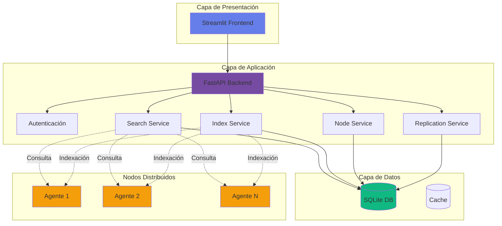
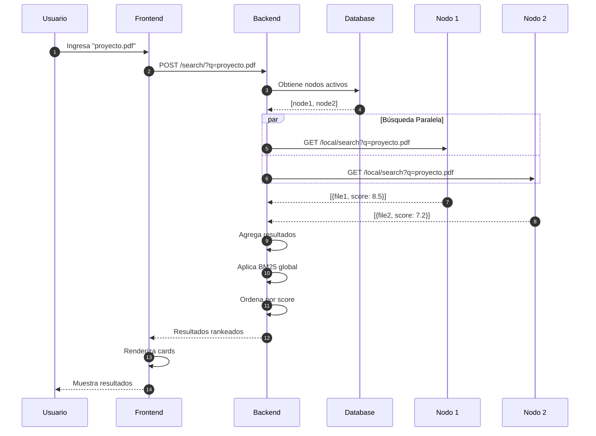
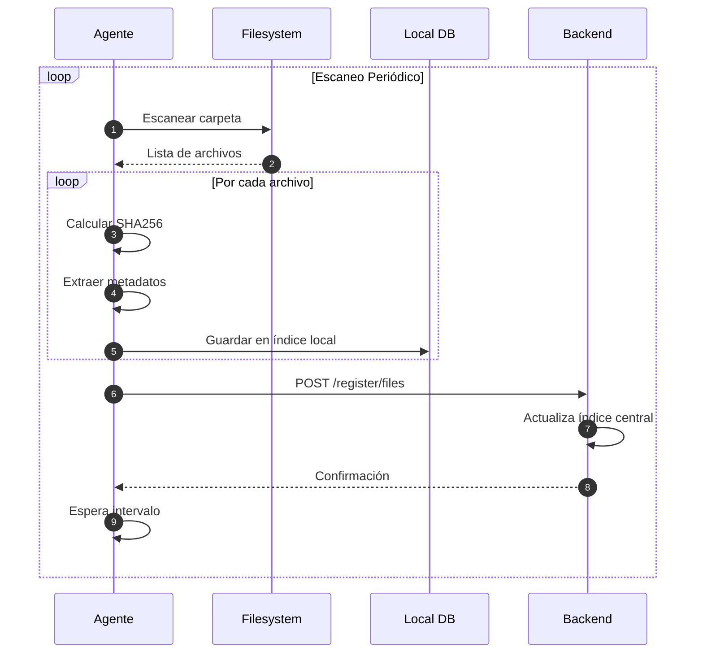
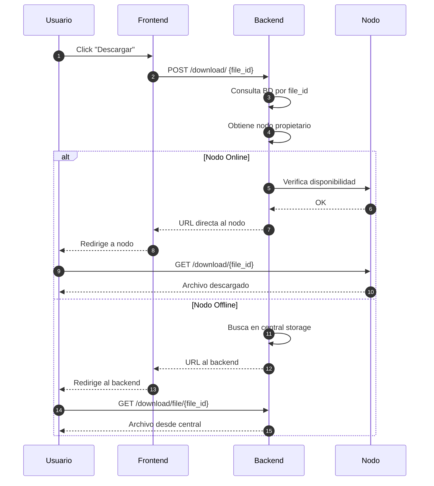
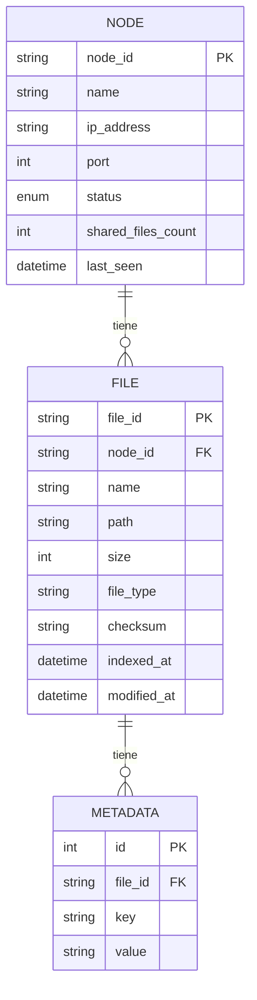
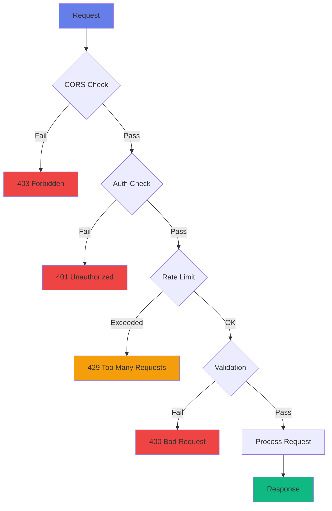
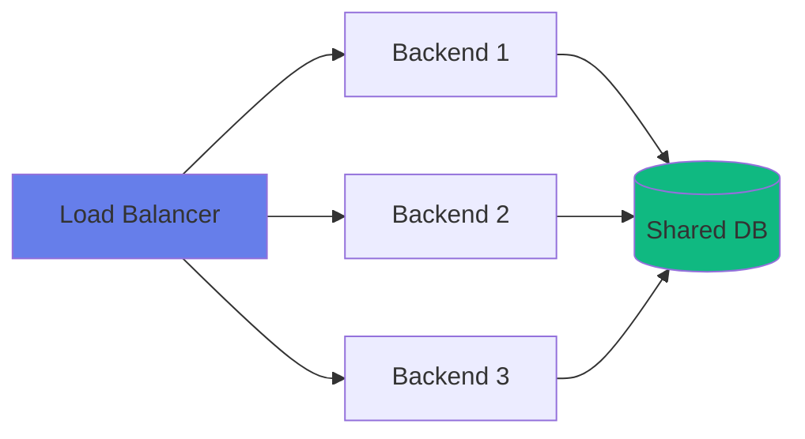

# Arquitectura del Sistema

Esta sección describe en detalle la arquitectura técnica de DistriSearch, incluyendo componentes, flujos de datos y decisiones de diseño.

---

## 🏗️ Arquitectura General



---

## 📦 Componentes Principales

### 1. Frontend (Streamlit)

**Responsabilidades**:

- Interfaz de usuario web
- Visualización de resultados
- Gestión de nodos
- Configuración del sistema

**Stack Tecnológico**:

```yaml
- Framework: Streamlit 1.32+
- Visualización: Plotly 5.18+
- HTTP Client: Requests
- Componentes: streamlit-extras, streamlit-option-menu
```

**Estructura**:

```
frontend/
├── app.py              # Página principal
├── pages/              # Sistema de páginas
│   ├── 01_🔍_Buscar.py
│   ├── 02_🌐_Nodos.py
│   ├── 03_🏢_Central.py
│   └── 04_📊_Estadísticas.py
├── components/         # Componentes reutilizables
│   ├── cards.py
│   └── styles.py
└── utils/             # Utilidades
    ├── api_client.py
    └── helpers.py
```

### 2. Backend (FastAPI)

**Responsabilidades**:

- API REST centralizada
- Coordinación de búsquedas
- Gestión de nodos
- Replicación de datos
- Modo centralizado

**Stack Tecnológico**:

```yaml
- Framework: FastAPI 0.109+
- ORM: SQLAlchemy 2.0+
- Validación: Pydantic 2.5+
- Base de Datos: SQLite
- ASGI Server: Uvicorn
```

**Estructura**:

```
backend/
├── main.py            # Punto de entrada
├── database.py        # Configuración BD
├── models.py          # Modelos SQLAlchemy
├── security.py        # Autenticación
├── routes/            # Endpoints
│   ├── search.py
│   ├── register.py
│   ├── download.py
│   └── central.py
├── services/          # Lógica de negocio
│   ├── index_service.py
│   ├── node_service.py
│   ├── central_service.py
│   └── replication_service.py
└── tests/            # Tests unitarios
```

### 3. Agente (Node Service)

**Responsabilidades**:

- Escaneo de carpetas locales
- Indexación de archivos
- API REST local
- Sincronización con backend

**Stack Tecnológico**:

```yaml
- Framework: FastAPI
- Scanner: watchdog (opcional)
- Hash: hashlib (SHA256)
- Threading: concurrent.futures
```

**Estructura**:

```
agent/
├── agent.py          # Orquestador principal
├── server.py         # API REST
├── scanner.py        # Escaneo de archivos
├── uploader.py       # Sincronización
└── config.yaml       # Configuración
```

---

## 🔄 Flujos de Datos

### Flujo de Búsqueda Distribuida



### Flujo de Indexación (Agente)



### Flujo de Descarga



---

## 🗄️ Modelo de Datos

### Diagrama ER



### Modelos SQLAlchemy

=== "Node Model"

    ```python
    class Node(Base):
        __tablename__ = "nodes"
        
        node_id = Column(String, primary_key=True)
        name = Column(String, nullable=False)
        ip_address = Column(String, nullable=False)
        port = Column(Integer, nullable=False)
        status = Column(Enum(NodeStatus), default=NodeStatus.OFFLINE)
        shared_files_count = Column(Integer, default=0)
        last_seen = Column(DateTime, default=datetime.utcnow)
        
        # Relación con archivos
        files = relationship("File", back_populates="node", cascade="all, delete-orphan")
    ```

=== "File Model"

    ```python
    class File(Base):
        __tablename__ = "files"
        
        file_id = Column(String, primary_key=True)
        node_id = Column(String, ForeignKey("nodes.node_id"))
        name = Column(String, nullable=False, index=True)
        path = Column(String)
        size = Column(Integer)
        file_type = Column(Enum(FileType))
        checksum = Column(String)
        indexed_at = Column(DateTime, default=datetime.utcnow)
        modified_at = Column(DateTime)
        
        # Relación con nodo
        node = relationship("Node", back_populates="files")
        
        # Índice para búsquedas
        __table_args__ = (
            Index('idx_name_type', 'name', 'file_type'),
        )
    ```

---

## 🔌 API Design

### Principios REST

DistriSearch sigue los principios REST:

| Principio | Implementación |
|-----------|----------------|
| **Stateless** | No se mantiene estado de sesión |
| **Cacheable** | Headers Cache-Control apropiados |
| **Uniform Interface** | Uso consistente de HTTP verbs |
| **Layered System** | Arquitectura en capas clara |

### Versionado de API

```http
# Versión en URL (futuro)
GET /api/v1/search/
GET /api/v2/search/

# Versión en header (actual)
X-API-Version: 1.0
```

### Códigos de Estado HTTP

| Código | Uso | Ejemplo |
|--------|-----|---------|
| `200` | Success | Búsqueda exitosa |
| `201` | Created | Nodo registrado |
| `400` | Bad Request | Parámetros inválidos |
| `401` | Unauthorized | API key inválida |
| `404` | Not Found | Archivo no encontrado |
| `500` | Server Error | Error interno |
| `503` | Service Unavailable | Nodo offline |

---

## 🔐 Seguridad en Capas



### Capas de Seguridad

1. **CORS**: Valida origen de peticiones
2. **Autenticación**: Verifica API key (opcional)
3. **Rate Limiting**: Previene abuso
4. **Validación**: Pydantic valida datos
5. **Sanitización**: Limpia inputs peligrosos

---

## 📡 Comunicación Entre Componentes

### Protocolo HTTP/REST

Toda la comunicación usa HTTP/REST:

```python
# Frontend → Backend
response = requests.post(
    "http://backend:8000/search/",
    json={"q": "documento"},
    headers={"X-API-KEY": api_key}
)

# Backend → Agente
response = requests.get(
    f"http://{node.ip_address}:{node.port}/local/search",
    params={"q": "documento"}
)
```

### Formato de Mensajes

Todos los mensajes usan **JSON**:

```json
{
  "status": "success",
  "data": {
    "files": [...],
    "total": 10,
    "query_time_ms": 150
  },
  "error": null
}
```

---

## ⚡ Optimizaciones de Rendimiento

### 1. Índices de Base de Datos

```sql
-- Índice en file_id para búsquedas rápidas
CREATE INDEX idx_file_id ON files(file_id);

-- Índice compuesto para filtros
CREATE INDEX idx_name_type ON files(name, file_type);

-- Índice en checksum para duplicados
CREATE INDEX idx_checksum ON files(checksum);
```

### 2. Búsquedas Asíncronas

```python
import asyncio
import aiohttp

async def search_node(session, node, query):
    url = f"http://{node.ip}:{node.port}/local/search"
    async with session.get(url, params={"q": query}) as response:
        return await response.json()

async def search_all_nodes(nodes, query):
    async with aiohttp.ClientSession() as session:
        tasks = [search_node(session, node, query) for node in nodes]
        return await asyncio.gather(*tasks)
```

### 3. Cache de Resultados

```python
from functools import lru_cache

@lru_cache(maxsize=1000)
def get_node_info(node_id: str):
    return db.query(Node).filter_by(node_id=node_id).first()
```

### 4. Paginación

```python
# Limitar resultados por defecto
@router.get("/search/")
async def search(
    q: str,
    max_results: int = Query(default=50, le=200)
):
    # ...
```

---

## 🧩 Patrones de Diseño Utilizados

| Patrón | Aplicación | Beneficio |
|--------|------------|-----------|
| **Repository** | `services/` | Abstracción de datos |
| **Singleton** | API Client | Única instancia |
| **Factory** | File scanners | Creación flexible |
| **Observer** | File watcher | Eventos de cambio |
| **Strategy** | Search algorithms | Algoritmos intercambiables |

---

## 🔮 Escalabilidad

### Escalado Horizontal



### Escalado de Nodos

Sin límite teórico de nodos:

- ✅ Cada nodo es independiente
- ✅ Búsqueda en paralelo
- ✅ Sin cuello de botella centralizado

---

[:octicons-arrow-left-24: Volver a Características](caracteristicas.md){ .md-button }
[:octicons-arrow-right-24: Comenzar Instalación](getting-started/instalacion.md){ .md-button .md-button--primary }
