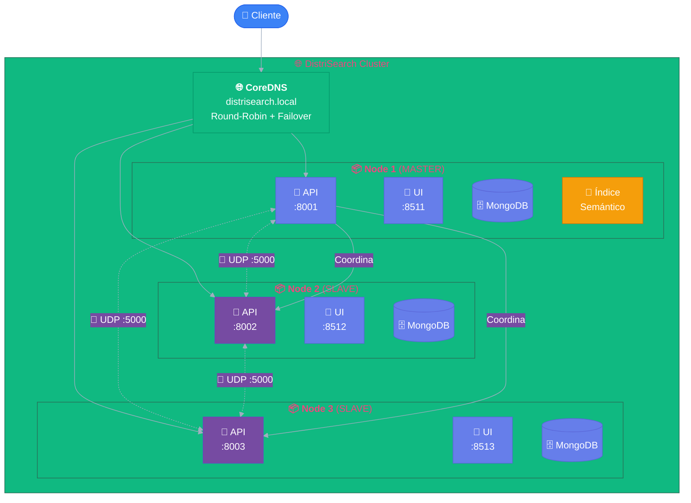

# 📐 Arquitectura del Sistema

<div style="padding: 1.5rem; background: linear-gradient(135deg, rgba(102, 126, 234, 0.1) 0%, rgba(118, 75, 162, 0.1) 100%); border-radius: 16px; margin-bottom: 2rem;">
  <div style="display: flex; align-items: center; gap: 0.5rem; margin-bottom: 0.5rem;">
    <span style="background: linear-gradient(135deg, #667eea, #764ba2); color: white; padding: 0.2rem 0.6rem; border-radius: 12px; font-size: 0.75rem; font-weight: 600;">v2.0</span>
    <span style="background: #10b981; color: white; padding: 0.2rem 0.6rem; border-radius: 12px; font-size: 0.75rem; font-weight: 600;">Master-Slave</span>
    <span style="background: #f59e0b; color: white; padding: 0.2rem 0.6rem; border-radius: 12px; font-size: 0.75rem; font-weight: 600;">Bully Election</span>
  </div>
  <p style="margin: 0.5rem 0 0 0; color: #718096;">Documentación técnica de la arquitectura <strong>Master-Slave distribuida</strong> con ubicación semántica de recursos.</p>
</div>

---

## 🏗️ Visión General

DistriSearch implementa una arquitectura **Master-Slave distribuida con failover automático**:

<div style="display: grid; grid-template-columns: repeat(auto-fit, minmax(200px, 1fr)); gap: 1rem; margin: 1.5rem 0;">

<div style="padding: 1.2rem; background: rgba(102, 126, 234, 0.08); border-radius: 12px; border: 1px solid rgba(102, 126, 234, 0.15); text-align: center;">
  <span style="font-size: 2rem;">👑</span>
  <h4 style="margin: 0.5rem 0 0.3rem 0;">Cualquier Nodo = Master</h4>
  <p style="margin: 0; font-size: 0.85rem; color: #718096;">Elección dinámica con Bully</p>
</div>

<div style="padding: 1.2rem; background: rgba(16, 185, 129, 0.08); border-radius: 12px; border: 1px solid rgba(16, 185, 129, 0.15); text-align: center;">
  <span style="font-size: 2rem;">🖥️</span>
  <h4 style="margin: 0.5rem 0 0.3rem 0;">Todos son Slaves</h4>
  <p style="margin: 0; font-size: 0.85rem; color: #718096;">Nodos autónomos por defecto</p>
</div>

<div style="padding: 1.2rem; background: rgba(245, 158, 11, 0.08); border-radius: 12px; border: 1px solid rgba(245, 158, 11, 0.15); text-align: center;">
  <span style="font-size: 2rem;">🧠</span>
  <h4 style="margin: 0.5rem 0 0.3rem 0;">Master Coordina</h4>
  <p style="margin: 0; font-size: 0.85rem; color: #718096;">Búsquedas y replicación</p>
</div>

<div style="padding: 1.2rem; background: rgba(239, 68, 68, 0.08); border-radius: 12px; border: 1px solid rgba(239, 68, 68, 0.15); text-align: center;">
  <span style="font-size: 2rem;">🛡️</span>
  <h4 style="margin: 0.5rem 0 0.3rem 0;">Sin Punto de Fallo</h4>
  <p style="margin: 0; font-size: 0.85rem; color: #718096;">Failover automático ~15s</p>
</div>

</div>



### Métricas Clave

| Característica | Valor | Descripción |
|:---------------|:------|:------------|
| **Latencia de consulta** | $O(1)$ saltos | Master enruta directamente al Slave apropiado |
| **Escalabilidad** | Lineal | Añadir más Slaves aumenta capacidad |
| **Tolerancia a fallos** | Alta | Sistema opera si falla cualquier nodo |
| **Tiempo de elección** | ~10-15 s | Algoritmo Bully |
| **Factor de replicación** | K=2 | Configurable |

---

## 📦 Estructura del Proyecto

La arquitectura del código sigue una separación clara de responsabilidades:

```
DistriSearch/
├── core/                          # 🔧 Código compartido por todos los nodos
│   ├── __init__.py
│   ├── config.py                 # Configuración unificada del cluster
│   └── models.py                 # Modelos de datos: NodeInfo, MessageType, etc.
│
├── cluster/                       # 🔗 Servicios de coordinación del cluster
│   ├── __init__.py
│   ├── heartbeat.py              # Sistema de heartbeats UDP
│   ├── election.py               # Algoritmo Bully para elección de líder
│   ├── discovery.py              # Descubrimiento de nodos (multicast)
│   └── naming/                   # Sistema de nombres
│       ├── hierarchical.py       # Naming jerárquico
│       └── ip_cache.py           # Caché de IPs
│
├── master/                        # 👑 Lógica específica del rol Master
│   ├── __init__.py
│   ├── embedding_service.py      # Generación de embeddings semánticos
│   ├── location_index.py         # Índice de ubicación semántica
│   ├── load_balancer.py          # Balanceo de carga entre Slaves
│   ├── query_router.py           # Enrutamiento de búsquedas
│   └── replication_coordinator.py # Coordinación de replicación
│
├── slave/                         # 🖥️ Lógica del nodo Slave
│   ├── api/                      # API REST (FastAPI)
│   │   ├── main.py               # Punto de entrada
│   │   ├── database.py           # Conexión MongoDB
│   │   ├── models.py             # Modelos Pydantic
│   │   ├── auth.py               # Autenticación JWT
│   │   └── routes/               # Endpoints
│   │       ├── search.py         # Búsqueda distribuida
│   │       ├── register.py       # Registro de nodos/archivos
│   │       ├── download.py       # Descarga de archivos
│   │       ├── cluster.py        # Operaciones de cluster
│   │       └── health.py         # Health checks
│   └── services/                 # Servicios del Slave
│       ├── index_service.py
│       ├── node_service.py
│       └── replication_service.py
│
├── frontend/                      # 🎨 UI Streamlit
│   ├── app.py
│   └── pages/
│
├── deploy/                        # 🚀 Configuración de despliegue
│   ├── docker-compose.yml
│   └── docker-compose.cluster.yml
│
├── dns/                           # 🌐 CoreDNS
│   ├── Corefile
│   └── hosts
│
└── tests/                         # ✅ Tests
    ├── unit/
    ├── integration/
    └── e2e/
```

---

## 🔧 Componentes Detallados

### 1. Core - Código Compartido

Módulos compartidos entre Master y Slaves que definen la base del sistema:

#### Configuración (`core/config.py`)

| Parámetro | Tipo | Default | Descripción |
|-----------|------|---------|-------------|
| `node_id` | string | `node_1` | Identificador único del nodo |
| `node_role` | enum | `slave` | Rol inicial: "master" o "slave" |
| `master_candidate` | bool | `true` | ¿Puede ser elegido Master? |
| `heartbeat_interval` | int | `5` | Segundos entre heartbeats |
| `heartbeat_timeout` | int | `15` | Timeout para considerar nodo caído |
| `replication_factor` | int | `2` | Número de réplicas (K) |
| `embedding_model` | string | `all-MiniLM-L6-v2` | Modelo para embeddings (384 dims) |
| `mongo_uri` | string | `mongodb://localhost:27017` | URI de MongoDB |

#### Modelos (`core/models.py`)

```python
# Enums
class NodeRole(Enum): SLAVE, MASTER
class NodeStatus(Enum): ONLINE, OFFLINE, UNKNOWN, STARTING
class MessageType(Enum): 
    PING, PONG,                    # Heartbeat
    ELECTION, ELECTION_OK, COORDINATOR,  # Bully
    REGISTER_CONTENT, QUERY_ROUTING, REPLICATE  # Datos

# Dataclasses principales
@dataclass
class NodeInfo:
    node_id: str
    ip_address: str
    port: int
    status: NodeStatus
    is_master: bool
    can_be_master: bool
    document_count: int
    last_seen: datetime

@dataclass
class ClusterMessage:
    type: MessageType
    sender_id: str
    payload: Dict
    timestamp: datetime

@dataclass
class SlaveProfile:
    slave_id: str
    embedding: np.ndarray  # Perfil semántico agregado
    document_count: int
    load_score: float      # 0.0 = sin carga, 1.0 = máxima
```

---

### 2. Cluster - Servicios de Coordinación

#### Sistema de Heartbeats (`cluster/heartbeat.py`)

Monitoreo de nodos mediante UDP para detección de fallos:

- **Protocolo**: UDP (puerto 5000)
- **Intervalo**: 5 segundos
- **Timeout**: 15 segundos (3 beats fallidos)
- **Mensajes**: `PING` → `PONG`

```
┌─────────┐          PING          ┌─────────┐
│  Node A │ ──────────────────────►│  Node B │
│         │◄────────────────────── │         │
└─────────┘          PONG          └─────────┘
```

#### Algoritmo Bully (`cluster/election.py`)

Elección de líder cuando el Master falla:

```
Algoritmo Bully para elección de Master:

1. Node_i detecta que Master no responde
2. Node_i envía ELECTION a todos Node_j donde j > i
3. Si ningún Node_j responde OK en timeout:
   → Node_i se convierte en Master
   → Node_i envía COORDINATOR a todos
4. Si algún Node_j responde OK:
   → Node_i espera mensaje COORDINATOR

Ejemplo con IDs 50, 60, 70 (Master=100 falla):
  Slave-50 ──ELECTION──► 60, 70
  Slave-60 ──OK──► 50
  Slave-70 ──OK──► 50
  Slave-60 ──ELECTION──► 70
  Slave-70 ──OK──► 60
  Slave-70 ──COORDINATOR──► todos (nuevo Master)
```

---

### 3. Master - Lógica de Coordinación

El Master es un Slave que asume responsabilidades adicionales:

| Componente | Responsabilidad |
|------------|-----------------|
| **EmbeddingService** | Genera vectores semánticos (384 dims) usando `sentence-transformers` |
| **SemanticLocationIndex** | Índice de ubicación por similitud coseno |
| **LoadBalancer** | Distribuye carga según afinidad y estado de nodos |
| **QueryRouter** | Enruta queries a Slaves con contenido semánticamente relevante |
| **ReplicationCoordinator** | Selecciona nodos para réplicas por afinidad semántica |

#### Flujo de Búsqueda Semántica

```
1. Usuario envía query al Master
2. Master calcula embedding de la query: q_embedding
3. Master ordena Slaves por similitud: cos(q_embedding, slave_profile)
4. Master envía query a top-3 Slaves más relevantes
5. Slaves ejecutan búsqueda local en MongoDB
6. Master agrega y rankea resultados finales
```

#### Selección de Nodos para Replicación

```
slave_destino = argmax_{s ∈ slaves} cos(embedding_doc, profile_s)
```

Criterios de selección:
1. **Afinidad semántica**: Slaves con perfil similar al documento
2. **Carga actual**: Balancear distribución de almacenamiento
3. **Disponibilidad**: Priorizar Slaves con alto uptime

---

### 4. Slave - Nodo Trabajador

Cada Slave es un nodo autónomo con:

- **Backend API** (FastAPI): Procesa requests REST
- **Frontend** (Streamlit): Interfaz de usuario
- **MongoDB**: Almacenamiento local de documentos

#### API Endpoints

| Endpoint | Método | Descripción |
|----------|--------|-------------|
| `/health` | GET | Check básico |
| `/health/cluster` | GET | Estado del cluster |
| `/search/?q={query}` | GET | Búsqueda distribuida |
| `/register/node` | POST | Registrar nodo |
| `/register/files` | POST | Registrar archivos |
| `/register/upload` | POST | Subir archivo |
| `/download/{file_id}` | GET | Descargar archivo |
| `/cluster/status` | GET | Estado del cluster |
| `/cluster/election` | POST | Forzar elección |

---

### 5. Frontend (Streamlit)

Interfaz web servida por cada Slave:

```
frontend/
├── app.py                    # Home con autenticación
├── pages/
│   ├── 01_🔍_Buscar.py      # Búsqueda distribuida
│   ├── 02_🌐_Nodos.py       # Gestión de nodos
│   ├── 03_📊_Estadísticas.py # Métricas del cluster
│   └── 04_📤_Subir_Archivos.py
└── utils/
    └── api_client.py         # Cliente HTTP para backend
```

---

### 6. DNS (CoreDNS)

Resolución DNS con failover automático:

- **Dominio**: `distrisearch.local`
- **Resolución**: Round-robin a Slaves saludables
- **Failover**: Automático si un Slave no responde

```
# Corefile
distrisearch.local:53 {
    hosts /etc/coredns/hosts {
        fallthrough
    }
    forward . 8.8.8.8
}

# hosts (se actualiza dinámicamente)
172.20.0.11 distrisearch.local
172.20.0.21 distrisearch.local
172.20.0.31 distrisearch.local
```

---

## 🔄 Flujos de Datos

### Flujo de Consulta Típico

```
1. Cliente envía consulta al Master (o cualquier Slave la redirige)
2. Master calcula embedding semántico de la consulta
3. Master identifica Slaves con contenido semánticamente relevante
4. Master enruta la consulta a los Slaves seleccionados (top-3)
5. Slaves ejecutan búsqueda local en MongoDB y devuelven resultados
6. Master agrega, rankea y devuelve resultados finales al cliente
```

### Flujo de Búsqueda Distribuida (Detallado)

```
┌──────────┐    1. Query     ┌──────────┐
│  Usuario │ ───────────────►│ Frontend │
│          │                 │(Streamlit)│
└──────────┘                 └────┬─────┘
                                  │
                          2. POST /search
                                  │
                                  ▼
                            ┌──────────┐
                            │  Backend │ (Slave local)
                            │ (FastAPI)│
                            └────┬─────┘
                                  │
                   3. Si tiene info del Master
                                  │
                                  ▼
                            ┌──────────┐
                            │  Master  │
                            │          │
                            └────┬─────┘
                                  │
            4. Calcula embedding ─┘
               q_emb = encode(query)
                                  │
            5. Ordena Slaves ─────┘
               por cos(q_emb, slave_profile)
                                  │
                    ┌─────────────┼─────────────┐
                    ▼             ▼             ▼
              ┌─────────┐   ┌─────────┐   ┌─────────┐
              │ Slave 1 │   │ Slave 2 │   │ Slave 3 │
              │  (top 1)│   │  (top 2)│   │  (top 3)│
              └────┬────┘   └────┬────┘   └────┬────┘
                   │             │             │
         6. Búsqueda local MongoDB
                   │             │             │
                   └─────────────┼─────────────┘
                                 │
                         7. Agregar resultados
                                 │
                                 ▼
                           ┌──────────┐
                           │ Respuesta│
                           │ al user  │
                           └──────────┘
```

### Flujo de Elección de Líder (Bully Algorithm)

```
Escenario: Master (node_id=100) falla, Slaves con IDs 50, 60, 70

Tiempo ─────────────────────────────────────────────────────────────►

t0: Master falla (no envía heartbeats)

t1: Slave-50 detecta timeout (3 heartbeats fallidos)
    Slave-50 ────ELECTION────► Slave-60
    Slave-50 ────ELECTION────► Slave-70

t2: Nodos con ID mayor responden OK
    Slave-60 ────ELECTION_OK──► Slave-50
    Slave-70 ────ELECTION_OK──► Slave-50

t3: Slave-50 espera... deja que nodos mayores compitan

t4: Slave-60 inicia su propia elección
    Slave-60 ────ELECTION────► Slave-70

t5: Slave-70 responde OK
    Slave-70 ────ELECTION_OK──► Slave-60

t6: Slave-70 no tiene nadie con ID mayor
    Slave-70 se proclama COORDINATOR

t7: Slave-70 anuncia a todos
    Slave-70 ────COORDINATOR──► Slave-50
    Slave-70 ────COORDINATOR──► Slave-60

t8: Todos reconocen a Slave-70 como nuevo Master ✓
```

### Flujo de Replicación por Afinidad Semántica

```
1. Usuario sube documento D a Slave-1
   POST /register/upload

2. Slave-1 almacena D en su MongoDB local
   ► Genera file_id único (UUID)
   ► Extrae contenido textual

3. Slave-1 notifica al Master
   POST /master/register_content
   {file_id, filename, content_preview}

4. Master genera embedding del documento
   doc_emb = embedding_service.encode(content)

5. Master actualiza su índice de ubicación
   location_index.register(file_id, doc_emb, slave_1)

6. Master selecciona Slaves para réplicas
   Para K=2: necesita 1 réplica adicional
   target = argmax_{s ∈ slaves, s ≠ slave_1} cos(doc_emb, profile_s)
   
   Ejemplo: D es sobre "Machine Learning"
   ► Slave-2 tiene perfil "Data Science, ML" → alta afinidad
   ► Slave-3 tiene perfil "Networking" → baja afinidad
   ► Se elige Slave-2

7. Master coordina replicación
   replication_coordinator.replicate(file_id, slave_1, [slave_2])

8. Slave-1 transfiere D a Slave-2
   ► Conexión directa Slave-Slave (no pasa por Master)

9. Master actualiza índice con nueva ubicación
   location_index.add_replica(file_id, slave_2)
```

---

## 🌐 Topología de Red

### Topología en Estrella con Redundancia

La red se estructura como una **topología en estrella** donde el Master actúa como nodo central, pero todos los Slaves mantienen conexiones entre sí para tolerancia a fallos.

```
                    ┌─────────┐
                    │ Master  │
                    │(Slave-1)│
                    └────┬────┘
                         │
           ┌─────────────┼─────────────┐
           │             │             │
      ┌────┴────┐   ┌────┴────┐   ┌────┴────┐
      │ Slave-2 │───│ Slave-3 │───│ Slave-4 │
      └────┬────┘   └────┬────┘   └────┬────┘
           │             │             │
           └─────────────┴─────────────┘
                  (heartbeats)
    
Leyenda:
  ─── Comunicación primaria (Master ↔ Slave)
  ... Comunicación secundaria (Slave ↔ Slave)
```

### Configuración Docker Network

```yaml
networks:
  distrisearch_cluster:
    driver: bridge
    ipam:
      config:
        - subnet: 172.20.0.0/24

# IPs Fijas asignadas:
# DNS:            172.20.0.2
# Slave-1 (API):  172.20.0.11
# Slave-1 (Web):  172.20.0.12
# Slave-2 (API):  172.20.0.21
# Slave-2 (Web):  172.20.0.22
# Slave-3 (API):  172.20.0.31
# Slave-3 (Web):  172.20.0.32
```

### Puertos del Sistema

| Puerto | Protocolo | Uso | Descripción |
|--------|-----------|-----|-------------|
| 8000 | TCP/HTTP | API Backend | Endpoints REST FastAPI |
| 8443 | TCP/HTTPS | API Backend SSL | Endpoints REST con TLS |
| 8501 | TCP/HTTP | Frontend Streamlit | Interfaz de usuario |
| 5000 | UDP | Heartbeats | Detección de nodos caídos |
| 5001 | UDP | Elección Bully | Mensajes ELECTION/COORDINATOR |
| 27017 | TCP | MongoDB | Base de datos local |
| 53 | UDP/TCP | DNS | CoreDNS para resolución |

---

## 🛡️ Tolerancia a Fallos

### Sistema de Heartbeats

```
Configuración:
├── Protocolo:       UDP
├── Intervalo:       5 segundos (HEARTBEAT_INTERVAL)
├── Timeout:         15 segundos (HEARTBEAT_TIMEOUT)
├── Beats fallidos:  3 (timeout / interval)
└── Puerto:          5000

Flujo:
┌─────────┐     PING      ┌─────────┐
│ Node A  │ ─────────────►│ Node B  │
│         │◄───────────── │         │
└─────────┘     PONG      └─────────┘

Si Node B no responde 3 PINGs consecutivos:
  1. Node A marca Node B como OFFLINE
  2. Node A notifica al Master
  3. Si Node B era Master → se inicia elección Bully
  4. Master coordina re-replicación de archivos de Node B
```

### Elección de Líder (Algoritmo Bully)

| Parámetro | Valor |
|-----------|-------|
| Trigger | Master no responde a 3 heartbeats consecutivos |
| Criterio | Gana el nodo con mayor `node_id` (lexicográfico) |
| Timeout elección | 5 segundos |
| Timeout coordinador | 10 segundos |
| Tiempo total | ~10-15 segundos |

### Modelo de Consistencia

| Aspecto | Implementación |
|---------|----------------|
| **Modelo** | Consistencia eventual |
| **Escrituras** | Primero local, luego replicación asíncrona |
| **Lecturas** | Cualquier réplica puede responder |
| **Conflictos** | Last-Write-Wins (documentos inmutables) |
| **Convergencia** | Garantizada por inmutabilidad |

### Replicación y Recuperación

```
Factor de replicación K=2:
► Cada documento existe en 2 Slaves
► Selección por afinidad semántica

Si Slave-X falla:
1. Master detecta fallo (heartbeat timeout)
2. Master identifica archivos con réplica única
3. Master coordina crear nuevas réplicas
   ► Selecciona nuevo destino por afinidad
4. Se restaura factor K=2 en otros Slaves
```

---

## 📊 Métricas de Confiabilidad

El sistema registra automáticamente métricas de confiabilidad:

| Métrica | Descripción | Fórmula |
|---------|-------------|---------|
| **MTBF** | Mean Time Between Failures | Tiempo promedio entre fallos |
| **MTTR** | Mean Time To Recovery | Tiempo promedio de recuperación |
| **Disponibilidad** | Uptime del sistema | `MTBF / (MTBF + MTTR)` |

**Endpoint**: `GET /health/cluster`

```json
{
  "cluster_status": "healthy",
  "total_nodes": 3,
  "online_nodes": 3,
  "master_id": "node_1",
  "metrics": {
    "mtbf_hours": 168.5,
    "mttr_seconds": 12.3,
    "availability": 0.9998
  }
}
```

---

## 🔧 Configuración por Variables de Entorno

```bash
# ════════════════════════════════════════════════════════════════════
# IDENTIFICACIÓN DEL NODO
# ════════════════════════════════════════════════════════════════════
NODE_ID=node_1                      # ID único del nodo (obligatorio)
NODE_ROLE=slave                     # Rol inicial: slave | master
MASTER_CANDIDATE=true               # ¿Puede ser elegido Master?

# ════════════════════════════════════════════════════════════════════
# RED
# ════════════════════════════════════════════════════════════════════
BACKEND_HOST=0.0.0.0                # IP de escucha del backend
BACKEND_PORT=8000                   # Puerto del API REST
EXTERNAL_IP=172.20.0.11             # IP externa (para otros nodos)
FRONTEND_PORT=8501                  # Puerto de Streamlit

# ════════════════════════════════════════════════════════════════════
# CLUSTER
# ════════════════════════════════════════════════════════════════════
# Formato: node_id:ip:api_port:hb_port:election_port, ...
CLUSTER_PEERS=node_2:172.20.0.21:8000:5000:5001,node_3:172.20.0.31:8000:5000:5001
HEARTBEAT_INTERVAL=5                # Segundos entre heartbeats
HEARTBEAT_TIMEOUT=15                # Timeout para considerar nodo caído
HEARTBEAT_UDP_PORT=5000             # Puerto UDP para heartbeats
ELECTION_UDP_PORT=5001              # Puerto UDP para elección Bully

# ════════════════════════════════════════════════════════════════════
# REPLICACIÓN
# ════════════════════════════════════════════════════════════════════
REPLICATION_ENABLED=true            # Habilitar replicación
REPLICATION_FACTOR=2                # Número de réplicas (K)
CONSISTENCY_MODEL=eventual          # Modelo: eventual | strong
SYNC_INTERVAL_SECONDS=60            # Intervalo de sincronización

# ════════════════════════════════════════════════════════════════════
# BASE DE DATOS
# ════════════════════════════════════════════════════════════════════
MONGO_URI=mongodb://localhost:27017 # URI de conexión MongoDB
MONGO_DBNAME=distrisearch           # Nombre de la base de datos

# ════════════════════════════════════════════════════════════════════
# EMBEDDINGS (Ubicación Semántica)
# ════════════════════════════════════════════════════════════════════
EMBEDDING_MODEL=all-MiniLM-L6-v2    # Modelo sentence-transformers

# ════════════════════════════════════════════════════════════════════
# SEGURIDAD
# ════════════════════════════════════════════════════════════════════
JWT_SECRET_KEY=change-me-in-production
JWT_ALGORITHM=HS256
ACCESS_TOKEN_EXPIRE_MINUTES=30
ADMIN_API_KEY=                      # API key para operaciones admin
```

---

## 🚀 Despliegue

### Docker Compose - Desarrollo Local

```bash
cd DistriSearch/deploy
docker-compose up -d
```

Levanta:
- 1 Backend (Slave)
- 1 Frontend (Streamlit)
- 1 MongoDB

### Docker Compose - Cluster de Prueba

```bash
cd DistriSearch/deploy
docker-compose -f docker-compose.cluster.yml up -d
```

Levanta:
- 1 CoreDNS
- 3 Nodos completos (Backend + Frontend + MongoDB cada uno)

### URLs de Acceso

| Componente | URL | Descripción |
|------------|-----|-------------|
| Frontend Node 1 | http://localhost:8511 | Interfaz Streamlit |
| Frontend Node 2 | http://localhost:8512 | Interfaz Streamlit |
| Frontend Node 3 | http://localhost:8513 | Interfaz Streamlit |
| API Node 1 | http://localhost:8001 | API REST |
| API Node 2 | http://localhost:8002 | API REST |
| API Node 3 | http://localhost:8003 | API REST |
| DNS | distrisearch.local | Resolución Round-Robin |

---

## 🔌 API Endpoints Completos

### Health Checks

| Endpoint | Método | Descripción |
|----------|--------|-------------|
| `/health` | GET | Check básico: `{"status": "healthy"}` |
| `/health/detailed` | GET | Métricas del sistema (CPU, RAM, disco) |
| `/health/cluster` | GET | Estado completo del cluster |
| `/health/ready` | GET | Readiness probe para Kubernetes |
| `/health/live` | GET | Liveness probe para Kubernetes |

### Búsqueda

| Endpoint | Método | Parámetros | Descripción |
|----------|--------|------------|-------------|
| `/search/?q={query}` | GET | `q`, `file_type`, `max_results` | Búsqueda distribuida |
| `/search/stats` | GET | - | Estadísticas del índice |
| `/search/nodes` | GET | - | Lista de nodos disponibles |

### Registro

| Endpoint | Método | Body | Descripción |
|----------|--------|------|-------------|
| `/register/node` | POST | `NodeInfo` | Registrar nodo en cluster |
| `/register/node/dynamic` | POST | `NodeRegistration` | Auto-registro dinámico |
| `/register/files` | POST | `List[FileMeta]` | Registrar metadatos de archivos |
| `/register/upload` | POST | `multipart/form-data` | Subir archivo |
| `/register/heartbeat/{node_id}` | POST | - | Enviar heartbeat |

### Descarga

| Endpoint | Método | Descripción |
|----------|--------|-------------|
| `/download/{file_id}` | GET | Descargar archivo por ID |
| `/download/info/{file_id}` | GET | Información del archivo |

### Cluster

| Endpoint | Método | Descripción |
|----------|--------|-------------|
| `/cluster/status` | GET | Estado actual del cluster |
| `/cluster/nodes` | GET | Lista de todos los nodos |
| `/cluster/master` | GET | Info del Master actual |
| `/cluster/election` | POST | Forzar elección de líder |

### Autenticación

| Endpoint | Método | Descripción |
|----------|--------|-------------|
| `/auth/register` | POST | Crear usuario |
| `/auth/login` | POST | Obtener token JWT |
| `/auth/me` | GET | Info del usuario actual |

---

## 📐 Fórmulas y Algoritmos Clave

### Similitud Coseno (Búsqueda Semántica)

$$
\cos(\theta) = \frac{A \cdot B}{\|A\| \|B\|} = \frac{\sum_{i=1}^{n} A_i B_i}{\sqrt{\sum_{i=1}^{n} A_i^2} \sqrt{\sum_{i=1}^{n} B_i^2}}
$$

Donde $A$ es el embedding de la query y $B$ es el perfil del Slave.

### Selección de Nodo para Replicación

$$
\text{slave\_destino} = \arg\max_{s \in \text{slaves}} \cos(\text{embedding}_{doc}, \text{profile}_s)
$$

### Disponibilidad del Sistema

$$
\text{Disponibilidad} = \frac{\text{MTBF}}{\text{MTBF} + \text{MTTR}}
$$

---

[:octicons-arrow-left-24: Volver](index.md){ .md-button }
[:octicons-arrow-right-24: Características](caracteristicas.md){ .md-button .md-button--primary }
