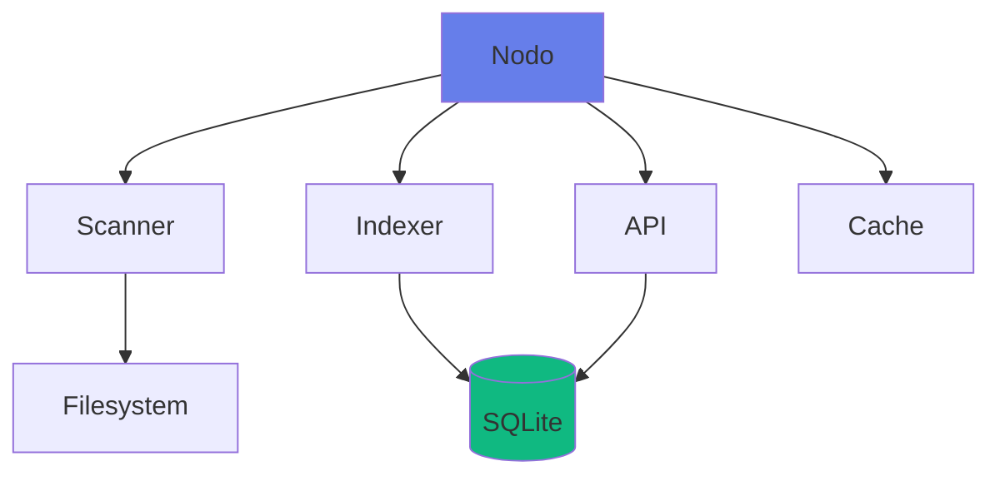
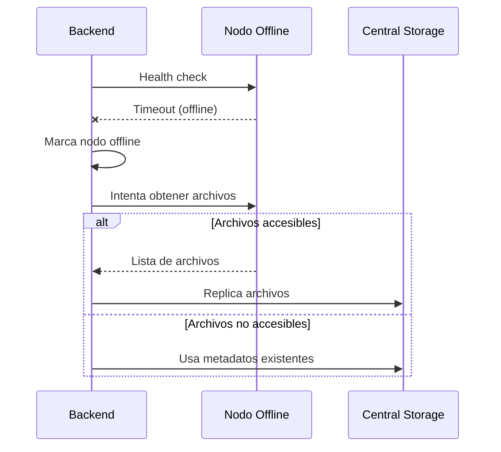

# Características de DistriSearch

DistriSearch ofrece un conjunto completo de características diseñadas para proporcionar una experiencia de búsqueda distribuida potente, flexible y fácil de usar.

---

## 🔍 Búsqueda Avanzada

### Algoritmo BM25

DistriSearch utiliza el algoritmo **BM25 (Best Matching 25)**, considerado el estándar de oro para ranking de relevancia en sistemas de búsqueda.

```python
# Ejemplo de búsqueda con score
GET /search/?q=documento&include_score=true

# Respuesta
{
  "files": [
    {
      "file_id": "abc123",
      "name": "documento_importante.pdf",
      "score": 8.456,  # Score BM25
      "type": "document",
      ...
    }
  ]
}
```

**Ventajas del BM25**:

- ✅ Resultados más relevantes
- ✅ Manejo de frecuencia de términos
- ✅ Normalización por longitud
- ✅ Ajustable con parámetros

### Búsqueda Multi-criterio

| Criterio | Descripción | Ejemplo |
|----------|-------------|---------|
| **Nombre** | Búsqueda en nombre de archivo | `proyecto.pdf` |
| **Contenido** | Búsqueda en contenido (texto) | `análisis de datos` |
| **Tipo** | Filtro por tipo de archivo | `document`, `image`, `video` |
| **Nodo** | Filtro por nodo específico | `node_madrid` |
| **Metadatos** | Búsqueda en metadatos | Fecha, tamaño, autor |

### Filtros Disponibles

=== "Por Tipo"

    ```python
    # Documentos
    GET /search/?q=proyecto&file_type=document
    
    # Imágenes
    GET /search/?q=logo&file_type=image
    
    # Videos
    GET /search/?q=presentacion&file_type=video
    ```

=== "Por Fecha"

    ```python
    # Archivos recientes (últimos 7 días)
    GET /search/?q=informe&days=7
    
    # Rango de fechas
    GET /search/?q=proyecto&from_date=2025-01-01&to_date=2025-01-31
    ```

=== "Por Tamaño"

    ```python
    # Archivos grandes (>10MB)
    GET /search/?q=video&min_size=10485760
    
    # Archivos pequeños (<1MB)
    GET /search/?q=documento&max_size=1048576
    ```

---

## 🌐 Arquitectura Distribuida

### Nodos Autónomos

Cada nodo opera de forma independiente:

- 🔄 **Escaneo automático**: Monitoreo continuo de carpetas
- 📊 **Índice local**: Base de datos SQLite propia
- 🔌 **API REST**: Interfaz de consulta independiente
- ⚡ **Cache local**: Respuestas rápidas



### Comunicación Asíncrona

El backend coordina búsquedas paralelas:

```python
# Búsqueda en paralelo a 5 nodos
import asyncio

async def search_all_nodes(query):
    tasks = [
        search_node(node1, query),
        search_node(node2, query),
        search_node(node3, query),
        search_node(node4, query),
        search_node(node5, query),
    ]
    results = await asyncio.gather(*tasks)
    return aggregate_results(results)
```

**Beneficios**:

- ⚡ Tiempo de respuesta reducido
- 🔄 Máximo paralelismo
- 📈 Escalabilidad lineal

### Descubrimiento de Nodos

!!! tip "Registro Dinámico"
    Los nodos pueden unirse o salir de la red dinámicamente sin afectar el servicio.

**Proceso de registro**:

1. Admin registra nuevo nodo via Frontend
2. Backend valida y almacena información
3. Backend hace health check al nodo
4. Nodo se marca como "online" si responde
5. Nodo queda disponible para búsquedas

---

## 🔄 Tolerancia a Fallos

### Replicación Automática

Cuando un nodo se cae, DistriSearch replica sus archivos:



**Configuración**:

```yaml
# backend/config
MAINTENANCE_INTERVAL_SECONDS: 300  # Check cada 5 min
NODE_TIMEOUT_SECONDS: 60           # Timeout de nodo
REPLICATION_BATCH_SIZE: 25         # Archivos por lote
```

### Health Checks

El backend monitorea constantemente los nodos:

| Estado | Descripción | Acción |
|--------|-------------|--------|
| `online` | Nodo responde correctamente | Disponible para búsquedas |
| `offline` | Nodo no responde | Excluido de búsquedas |
| `timeout` | Timeout excedido | Marcado offline automáticamente |

---

## 🎨 Interfaz Moderna

### Frontend con Streamlit

Interfaz web completamente rediseñada en v2.0:

**Características visuales**:

- 🌈 **Glassmorphism UI**: Efectos de cristal y transparencias
- ⚡ **Animaciones CSS**: Transiciones suaves y elegantes
- 🎭 **Tema claro/oscuro**: Cambio dinámico de tema
- 📱 **Responsive**: Adaptable a móviles y tablets
- 📊 **Gráficos interactivos**: Plotly para visualizaciones

**Componentes personalizados**:

```python
# Tarjeta de métrica
metric_card(
    label="Archivos Totales",
    value="1,234",
    delta="+45",
    icon="📁"
)

# Tarjeta de archivo
file_card(
    name="proyecto.pdf",
    file_type="document",
    size="2.5 MB",
    node_name="Nodo Madrid",
    status="online"
)
```

### Páginas del Sistema

| Página | Función | Características |
|--------|---------|----------------|
| 🏠 **Home** | Inicio y resumen | Métricas, features, modo actual |
| 🔍 **Buscar** | Búsqueda de archivos | Filtros, resultados, download |
| 🌐 **Nodos** | Gestión de nodos | Registro, eliminación, estado |
| 🏢 **Central** | Repositorio central | Escaneo, indexación |
| 📊 **Estadísticas** | Métricas del sistema | Gráficos, distribución, salud |

---

## 🐳 Despliegue Flexible

### Múltiples Opciones

=== "Desarrollo Local"

    ```bash
    # Backend
    cd backend && python main.py
    
    # Frontend
    cd frontend && streamlit run app.py
    
    # Agente
    cd agent && python agent.py
    ```

=== "Docker Compose"

    ```bash
    cd deploy
    docker-compose up -d
    ```
    
    **Servicios incluidos**:
    - Backend
    - Frontend
    - 2+ Agentes
    - Red interna

=== "Docker Swarm"

    ```bash
    docker stack deploy -c docker-stack.yml distrisearch
    ```
    
    **Características**:
    - Orquestación automática
    - Escalado horizontal
    - Load balancing
    - Service discovery

=== "Kubernetes"

    ```bash
    kubectl apply -f k8s/
    ```
    
    **Recursos**:
    - Deployments
    - Services
    - ConfigMaps
    - Persistent Volumes

---

## 📊 Monitoreo y Métricas

### Métricas Disponibles

DistriSearch proporciona métricas detalladas del sistema:

**Métricas generales**:

- 📁 Total de archivos indexados
- 🖥️ Número de nodos (total y activos)
- 📋 Archivos duplicados detectados
- ⚡ Tiempo de respuesta promedio

**Métricas por nodo**:

- 📊 Archivos compartidos
- 💾 Espacio utilizado
- 🟢 Estado actual (online/offline)
- ⏱️ Última sincronización

**Visualizaciones**:

```python
# Gráfico de distribución de tipos
pie_chart = px.pie(
    data,
    values='count',
    names='file_type',
    title='Distribución de Archivos por Tipo'
)

# Gauge de disponibilidad
gauge = go.Indicator(
    mode="gauge+number",
    value=availability_percent,
    title="Disponibilidad del Sistema"
)
```

---

## 🔐 Seguridad Robusta

### Autenticación

```python
# API Key en headers
headers = {
    "X-API-KEY": "your-secret-api-key-here"
}

# Ejemplo de petición autenticada
response = requests.post(
    "http://backend:8000/register/node",
    json=node_data,
    headers=headers
)
```

### Validación de Datos

Todos los datos se validan con **Pydantic**:

```python
class FileMetadata(BaseModel):
    name: str = Field(..., min_length=1, max_length=255)
    size: int = Field(..., ge=0)
    file_type: FileType
    checksum: str = Field(..., regex=r'^[a-f0-9]{64}$')
    
    @validator('name')
    def validate_name(cls, v):
        if '..' in v or '/' in v:
            raise ValueError('Invalid filename')
        return v
```

### CORS Configurado

```python
app.add_middleware(
    CORSMiddleware,
    allow_origins=["http://localhost:8501"],  # Frontend
    allow_credentials=True,
    allow_methods=["*"],
    allow_headers=["*"],
)
```

---

## 🚀 Rendimiento

### Optimizaciones Implementadas

| Técnica | Beneficio | Implementación |
|---------|-----------|----------------|
| **Índices de BD** | Consultas 10x más rápidas | SQLite indexes en `file_id`, `node_id` |
| **Cache** | Reduce latencia | Redis opcional |
| **Búsqueda paralela** | Tiempo lineal → logarítmico | asyncio |
| **Paginación** | Reduce payload | `max_results` parameter |
| **Compresión** | Menor ancho de banda | gzip responses |

### Benchmarks

!!! success "Rendimiento en Producción"
    - 🔍 Búsqueda en 5 nodos: **< 200ms**
    - 📊 Indexación de 10,000 archivos: **< 5 min**
    - 💾 Tamaño de BD (100k archivos): **< 50 MB**
    - 🌐 Throughput: **100+ req/s**

---

## 📱 API REST Completa

### Swagger UI Integrado

Accede a la documentación interactiva en:

```
http://localhost:8000/docs
```

**Características**:

- 📖 Documentación automática
- 🧪 Prueba de endpoints
- 📋 Esquemas de datos
- 🔐 Autenticación integrada

### Endpoints Principales

```http
# Búsqueda
GET /search/?q={query}&file_type={type}

# Nodos
GET /search/nodes
POST /register/node
DELETE /register/node/{node_id}

# Descarga
POST /download/
GET /download/file/{file_id}

# Central
POST /central/scan
GET /central/stats
```

---

## 🎯 Casos de Uso Especiales

### 1. Búsqueda por Contenido

```python
# Buscar archivos que contengan "machine learning"
GET /search/?q=machine learning&search_in_content=true
```

### 2. Búsqueda Fuzzy

```python
# Buscar con tolerancia a errores tipográficos
GET /search/?q=dokumento&fuzzy=true
```

### 3. Agregación de Resultados

```python
# Obtener solo los mejores 10 resultados
GET /search/?q=informe&max_results=10&sort=score
```

---

## 🔮 Funcionalidades Futuras

!!! info "Roadmap"
    - [ ] Búsqueda por similitud semántica (embeddings)
    - [ ] Previsualización de archivos en el frontend
    - [ ] Chat con archivos (RAG)
    - [ ] Versionado de archivos
    - [ ] Cifrado end-to-end
    - [ ] Modo offline para nodos
    - [ ] Machine learning para ranking personalizado

---

[:octicons-arrow-left-24: Volver a Introducción](introduccion.md){ .md-button }
[:octicons-arrow-right-24: Ver Arquitectura](arquitectura.md){ .md-button .md-button--primary }
