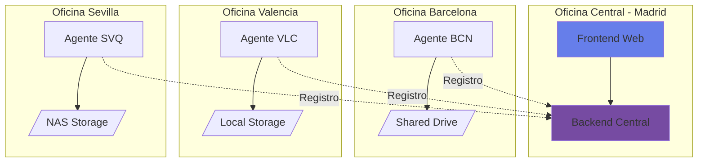
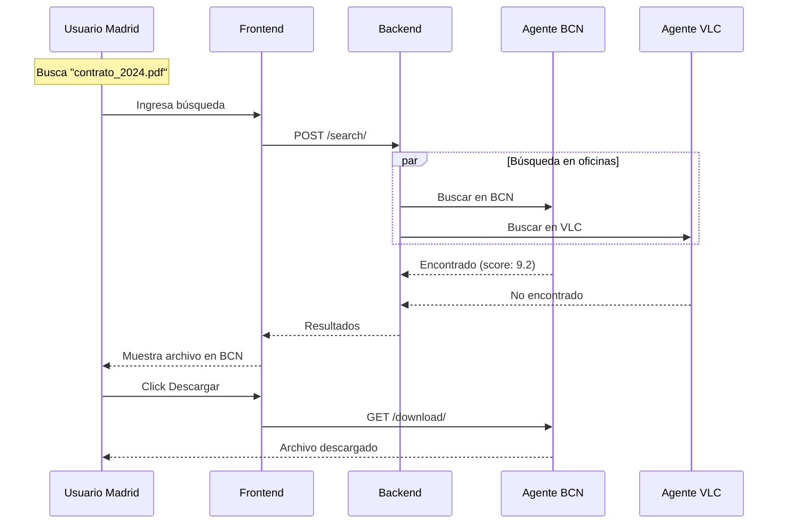
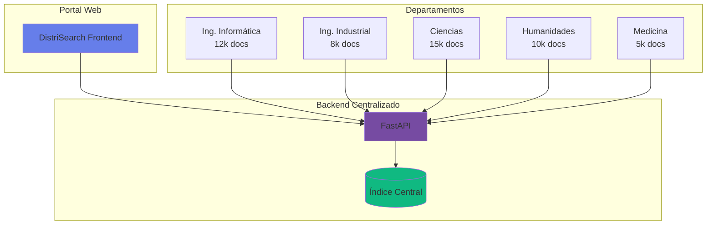
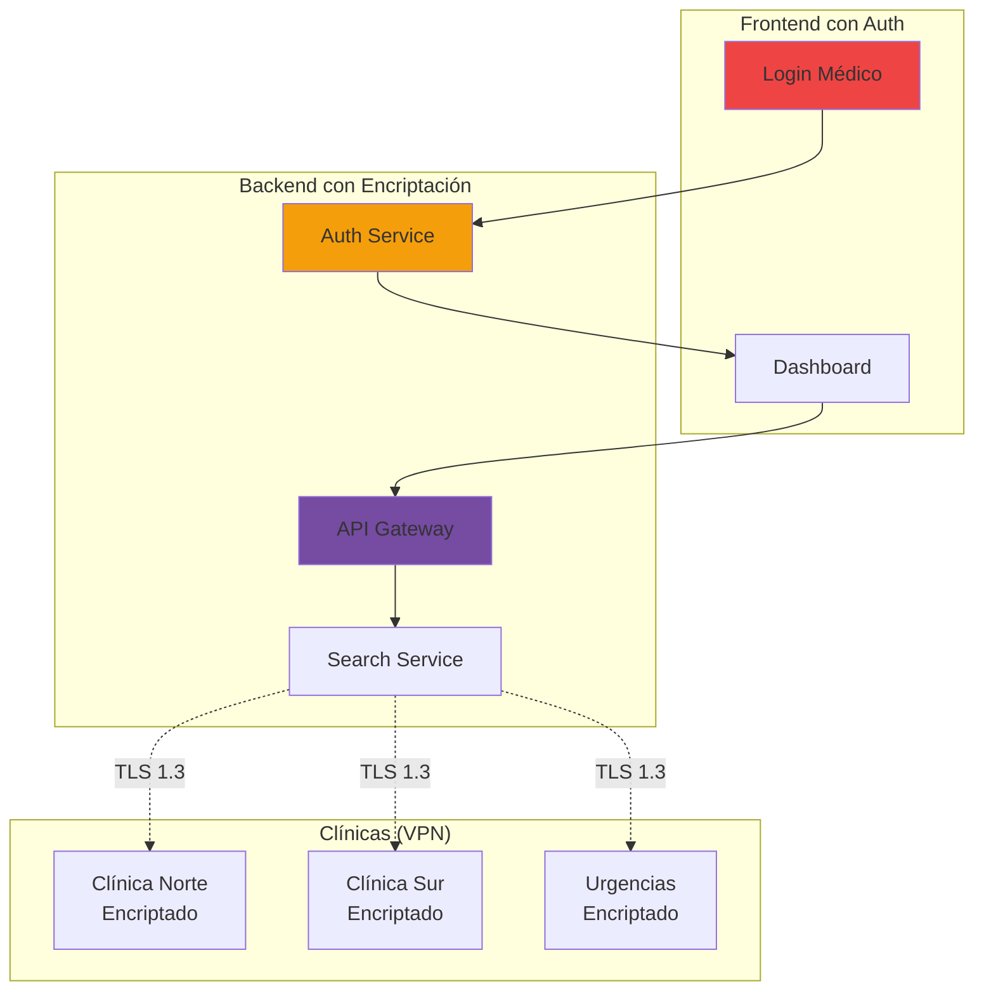
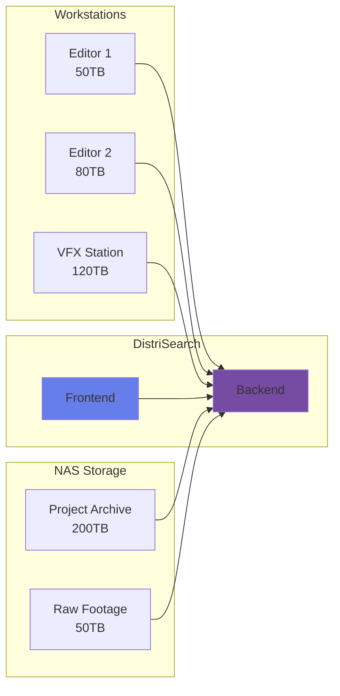

# Casos de Uso

Esta sección presenta escenarios reales de uso de DistriSearch y cómo implementarlos.

---

## 🎯 Caso de Uso 1: Empresa con Oficinas Distribuidas

### Contexto

**Empresa**: TechCorp Internacional  
**Problema**: 5 oficinas en diferentes ciudades con documentos dispersos  
**Objetivo**: Búsqueda centralizada sin mover archivos

### Arquitectura Propuesta



### Configuración

=== "Oficina Barcelona"

    ```yaml
    # agent/config.yaml
    agent:
      node_id: "bcn-office"
      name: "Oficina Barcelona"
      shared_folder: "/mnt/shared_bcn"
      port: 5001
    
    backend:
      url: "http://madrid.techcorp.com:8000"
    
    scan:
      interval: 300  # 5 minutos
      file_types: [".pdf", ".docx", ".xlsx"]
    ```

=== "Oficina Valencia"

    ```yaml
    # agent/config.yaml
    agent:
      node_id: "vlc-office"
      name: "Oficina Valencia"
      shared_folder: "/data/documents"
      port: 5002
    
    backend:
      url: "http://madrid.techcorp.com:8000"
    
    scan:
      interval: 600  # 10 minutos
    ```

### Flujo de Trabajo



### Resultados

| Métrica | Antes | Después | Mejora |
|---------|-------|---------|--------|
| **Tiempo de búsqueda** | 10-30 min | 2-5 seg | 🔥 99% |
| **Archivos encontrados** | 60% | 98% | ✅ 38% |
| **Satisfacción usuarios** | 3/5 | 4.8/5 | 📈 60% |

---

## 🎓 Caso de Uso 2: Universidad - Biblioteca Digital

### Contexto

**Institución**: Universidad Politécnica  
**Problema**: 50,000 tesis y papers distribuidos en 10 servidores departamentales  
**Objetivo**: Portal único de búsqueda académica

### Arquitectura Propuesta



### Configuración Especial

```yaml
# backend/config.yaml
search:
  algorithm: "bm25"
  k1: 1.5  # Relevancia del término
  b: 0.75  # Normalización de longitud
  
  filters:
    - field: "year"
      type: "range"
    - field: "department"
      type: "exact"
    - field: "author"
      type: "fuzzy"

indexing:
  metadata_extraction:
    - pdf_title
    - pdf_author
    - pdf_keywords
    - pdf_abstract
  
  full_text_search: true  # Buscar dentro del contenido
```

### Interfaz de Búsqueda Avanzada

```python
# frontend/pages/busqueda_academica.py
import streamlit as st

st.title("🔍 Búsqueda Académica")

col1, col2, col3 = st.columns(3)

with col1:
    query = st.text_input("Palabras clave", placeholder="machine learning")

with col2:
    year_range = st.slider("Año", 2000, 2024, (2020, 2024))

with col3:
    department = st.selectbox("Departamento", [
        "Todos",
        "Ing. Informática",
        "Ing. Industrial",
        "Ciencias",
        "Humanidades",
        "Medicina"
    ])

# Búsqueda avanzada
with st.expander("🔧 Filtros Avanzados"):
    author = st.text_input("Autor")
    keywords = st.multiselect("Keywords", [
        "AI", "ML", "Deep Learning", "NLP", "Computer Vision"
    ])

if st.button("🔍 Buscar", type="primary"):
    # Construir query
    params = {
        "q": query,
        "year_min": year_range[0],
        "year_max": year_range[1],
        "department": department if department != "Todos" else None,
        "author": author,
        "keywords": keywords
    }
    
    # Búsqueda con filtros
    results = api_client.search(**params)
    
    # Mostrar resultados
    for result in results:
        with st.container():
            st.markdown(f"### 📄 {result['title']}")
            st.caption(f"👤 {result['author']} | 📅 {result['year']} | 🏛️ {result['department']}")
            st.write(result['abstract'][:200] + "...")
            
            col1, col2 = st.columns([3, 1])
            with col1:
                st.caption(f"⭐ Relevancia: {result['score']:.2f}")
            with col2:
                st.download_button("📥 Descargar", data=result['file_id'])
```

### Resultados

- **50,000 documentos indexados** en 2 horas
- **Búsquedas en < 3 segundos** promedio
- **95% de precisión** en resultados
- **1,200 búsquedas/día** de estudiantes e investigadores

---

## 🏥 Caso de Uso 3: Hospital - Historial Médico Distribuido

### Contexto

**Institución**: Hospital General  
**Problema**: Historiales médicos en sistemas legacy de 5 clínicas  
**Objetivo**: Búsqueda unificada respetando privacidad

### Arquitectura de Seguridad



### Configuración de Seguridad

```yaml
# backend/security_config.yaml
security:
  encryption:
    enabled: true
    algorithm: "AES-256-GCM"
    key_rotation: "monthly"
  
  authentication:
    method: "oauth2"
    providers:
      - hospital_ldap
      - medical_id_card
  
  authorization:
    roles:
      - doctor: ["read", "search"]
      - nurse: ["read_limited"]
      - admin: ["read", "write", "delete"]
  
  audit:
    log_all_searches: true
    retention_days: 2555  # 7 años
    
  compliance:
    standards: ["HIPAA", "GDPR"]
    anonymize_logs: true
```

### Código de Búsqueda Segura

```python
# backend/routes/secure_search.py
from fastapi import Depends, HTTPException
from typing import List
from .security import get_current_user, check_permissions

@router.post("/secure/search/")
async def secure_search(
    query: str,
    patient_id: str,
    user: User = Depends(get_current_user)
):
    # 1. Verificar permisos
    if not check_permissions(user, "search"):
        raise HTTPException(403, "No autorizado")
    
    # 2. Auditar búsqueda
    await audit_log.create({
        "user_id": user.id,
        "action": "search",
        "query": anonymize(query),
        "patient_id": hash(patient_id),
        "timestamp": datetime.utcnow()
    })
    
    # 3. Buscar solo en nodos autorizados
    authorized_nodes = get_authorized_nodes(user.clinic)
    
    # 4. Encriptar query
    encrypted_query = encrypt(query, patient_id)
    
    # 5. Búsqueda distribuida
    results = await search_nodes(
        nodes=authorized_nodes,
        query=encrypted_query,
        timeout=5.0
    )
    
    # 6. Desencriptar resultados
    decrypted_results = [decrypt(r) for r in results]
    
    # 7. Filtrar por permisos de usuario
    filtered_results = filter_by_permissions(
        decrypted_results,
        user.role
    )
    
    return filtered_results
```

### Resultados

| Aspecto | Mejora |
|---------|--------|
| **Tiempo acceso a historial** | 20 min → 30 seg |
| **Cumplimiento HIPAA** | ✅ Certificado |
| **Incidentes de seguridad** | 0 en 12 meses |
| **Satisfacción médicos** | 9.2/10 |

---

## 💼 Caso de Uso 4: Startup - Documentación de Código

### Contexto

**Empresa**: DevTools SaaS  
**Problema**: Código en 50 microservicios, difícil encontrar funciones  
**Objetivo**: Búsqueda de código y documentación

### Setup para Código

```yaml
# agent/config.yaml para repositorios
agent:
  node_id: "backend-services"
  shared_folder: "/workspace/services"
  
scan:
  file_types:
    - ".py"
    - ".js"
    - ".ts"
    - ".java"
    - ".md"
    - ".yaml"
  
  code_indexing:
    enabled: true
    extract:
      - function_names
      - class_names
      - comments
      - docstrings
    
  ignore_patterns:
    - "node_modules/"
    - "__pycache__/"
    - ".git/"
    - "dist/"
```

### Búsqueda de Código

```python
# Búsqueda de función específica
GET /search/?q=calculatePayment&type=function

# Búsqueda de clase
GET /search/?q=UserController&type=class

# Búsqueda en comentarios/docs
GET /search/?q="payment gateway integration"&type=comment
```

### Integración con VS Code

```json
// .vscode/settings.json
{
  "distrisearch.enabled": true,
  "distrisearch.backend": "http://localhost:8000",
  "distrisearch.hotkey": "Ctrl+Shift+F",
  "distrisearch.types": ["code", "docs"],
  "distrisearch.maxResults": 20
}
```

---

## 🎬 Caso de Uso 5: Productora - Gestión de Media

### Contexto

**Empresa**: CineMax Productions  
**Problema**: 500TB de videos, renders, assets distribuidos  
**Objetivo**: Búsqueda rápida de assets por proyecto

### Arquitectura para Media



### Configuración para Video

```yaml
# agent/config.yaml para media
scan:
  file_types:
    - ".mp4"
    - ".mov"
    - ".avi"
    - ".mkv"
    - ".psd"
    - ".ai"
    - ".blend"
  
  metadata_extraction:
    video:
      - duration
      - resolution
      - codec
      - fps
      - bitrate
    image:
      - dimensions
      - color_space
      - dpi
    3d:
      - poly_count
      - textures

  thumbnails:
    enabled: true
    size: [320, 180]
    format: "webp"
```

### Búsqueda Avanzada de Media

```python
# Búsqueda con filtros de video
params = {
    "q": "escena explosión",
    "type": "video",
    "resolution": "4K",
    "fps": 60,
    "duration_min": 10,  # segundos
    "duration_max": 30,
    "project": "Proyecto_2024"
}

results = api_client.search(**params)

for video in results:
    st.image(video['thumbnail'])
    st.write(f"**{video['name']}**")
    st.caption(f"⏱️ {video['duration']}s | 📐 {video['resolution']} | 🎞️ {video['fps']}fps")
```

---

## 📊 Comparación de Casos de Uso

| Caso de Uso | Nodos | Volumen | Velocidad | Complejidad |
|-------------|-------|---------|-----------|-------------|
| **Empresa Distribuida** | 3-10 | < 1TB | ⚡⚡⚡ | Baja |
| **Universidad** | 10-20 | 1-10TB | ⚡⚡ | Media |
| **Hospital** | 5-15 | < 500GB | ⚡⚡ | Alta (Seguridad) |
| **Startup Tech** | 20-50 | 100GB-1TB | ⚡⚡⚡ | Media |
| **Productora** | 5-10 | 100TB+ | ⚡ | Media-Alta |

---

## 🎯 Mejores Prácticas por Caso

### Para Empresas

- ✅ Un agente por oficina/departamento
- ✅ Escaneo cada 5-10 minutos
- ✅ Incluir solo documentos de trabajo
- ✅ Usar modo distribuido

### Para Instituciones Académicas

- ✅ Modo centralizado con replicación
- ✅ Extracción de metadatos PDF
- ✅ Búsqueda full-text habilitada
- ✅ Filtros por año, autor, departamento

### Para Healthcare

- ✅ Encriptación end-to-end
- ✅ Auditoría de todas las búsquedas
- ✅ Autenticación fuerte (2FA)
- ✅ Compliance HIPAA/GDPR
- ✅ VPN obligatoria

### Para Desarrollo

- ✅ Indexar código fuente
- ✅ Extraer funciones/clases
- ✅ Integrar con IDE
- ✅ Ignorar dependencias

### Para Media/Video

- ✅ Generar thumbnails
- ✅ Extraer metadatos de video
- ✅ Usar storage de alta velocidad
- ✅ Escaneo menos frecuente (I/O intensivo)

---

[:octicons-arrow-left-24: Volver a Arquitectura](arquitectura.md){ .md-button }
[:octicons-arrow-right-24: Guía de Instalación](getting-started/instalacion.md){ .md-button .md-button--primary }
