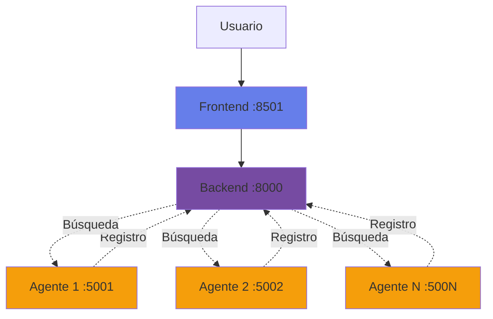
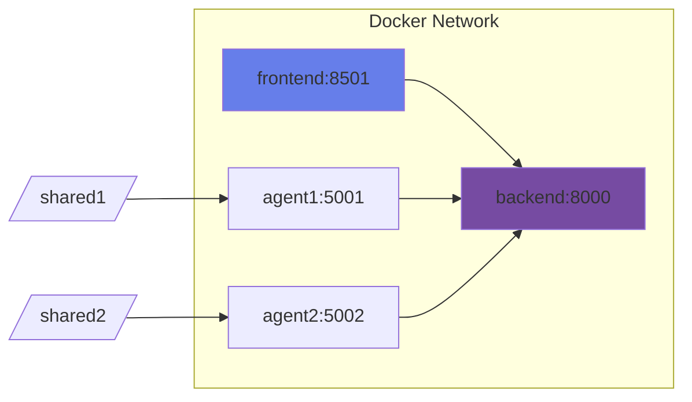
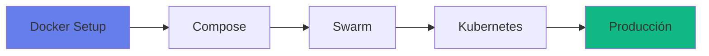

# Comenzar con DistriSearch

¡Bienvenido a DistriSearch! Esta guía te ayudará a poner en marcha el sistema de búsqueda distribuida en minutos.

---

## 🚀 Inicio Rápido

### Opción 1: Docker Compose (Recomendado)

La forma más rápida de probar DistriSearch:

```bash
# 1. Clonar repositorio
git clone https://github.com/Pol4720/DS-Project.git
cd DistriSearch

# 2. Iniciar servicios
cd deploy
docker-compose up -d

# 3. Acceder a la interfaz
# Frontend: http://localhost:8501
# Backend API: http://localhost:8000
# Docs API: http://localhost:8000/docs
```

### Opción 2: Instalación Local

Para desarrollo o personalización:

```bash
# 1. Clonar repositorio
git clone https://github.com/Pol4720/DS-Project.git
cd DistriSearch

# 2. Backend
cd backend
pip install -r requirements.txt
uvicorn main:app --reload

# 3. Frontend (nueva terminal)
cd frontend
pip install -r requirements.txt
streamlit run app.py

# 4. Agente (nueva terminal)
cd agent
pip install -r requirements.txt
python agent.py
```

---

## 📋 Requisitos Previos

### Hardware Mínimo

| Componente | Backend | Agente | Frontend |
|------------|---------|--------|----------|
| **CPU** | 2 cores | 1 core | 1 core |
| **RAM** | 2 GB | 512 MB | 1 GB |
| **Disco** | 10 GB | Según datos | 1 GB |
| **Red** | 1 Mbps | 1 Mbps | 100 Kbps |

### Hardware Recomendado

| Componente | Backend | Agente | Frontend |
|------------|---------|--------|----------|
| **CPU** | 4+ cores | 2 cores | 2 cores |
| **RAM** | 8 GB | 2 GB | 2 GB |
| **Disco** | SSD 50 GB | SSD según datos | SSD 10 GB |
| **Red** | 100 Mbps | 10 Mbps | 10 Mbps |

### Software

=== "Linux"

    ```bash
    # Ubuntu/Debian
    - Python 3.8+
    - pip
    - Docker (opcional)
    - Docker Compose (opcional)
    
    # Instalar Python y pip
    sudo apt update
    sudo apt install python3 python3-pip
    
    # Instalar Docker
    curl -fsSL https://get.docker.com -o get-docker.sh
    sudo sh get-docker.sh
    ```

=== "Windows"

    ```powershell
    # Requerido
    - Python 3.8+ (python.org)
    - pip (incluido con Python)
    - Docker Desktop (opcional)
    
    # Verificar instalación
    python --version
    pip --version
    docker --version
    ```

=== "macOS"

    ```bash
    # Instalar Homebrew
    /bin/bash -c "$(curl -fsSL https://raw.githubusercontent.com/Homebrew/install/HEAD/install.sh)"
    
    # Instalar Python
    brew install python@3.11
    
    # Instalar Docker Desktop
    brew install --cask docker
    ```

---

## 🎯 Arquitectura de Despliegue

### Topología Simple (1 Backend + N Agentes)



### Topología con Docker Compose



---

## 🔑 Primeros Pasos

### 1. Verificar Instalación

```bash
# Backend
curl http://localhost:8000/health
# Respuesta: {"status": "ok"}

# Frontend
# Navegar a http://localhost:8501

# Agente
curl http://localhost:5001/health
# Respuesta: {"status": "ok", "node_id": "agent1"}
```

### 2. Registrar Primer Nodo

```bash
# Desde el agente, se registra automáticamente
# O manualmente:
curl -X POST http://localhost:8000/register/ \
  -H "Content-Type: application/json" \
  -d '{
    "node_id": "my-node",
    "name": "Mi Primer Nodo",
    "ip_address": "192.168.1.100",
    "port": 5001
  }'
```

### 3. Indexar Archivos

```bash
# El agente escanea automáticamente cada N minutos
# O forzar escaneo:
curl -X POST http://localhost:5001/scan
```

### 4. Primera Búsqueda

```bash
# Desde frontend o API
curl "http://localhost:8000/search/?q=documento"

# Respuesta:
{
  "files": [
    {
      "file_id": "abc123",
      "name": "documento.pdf",
      "score": 8.5,
      "node": "my-node"
    }
  ],
  "total": 1,
  "query_time_ms": 150
}
```

---

## 📚 Estructura del Proyecto

```
DistriSearch/
├── backend/           # API REST centralizada
│   ├── main.py       # FastAPI app
│   ├── routes/       # Endpoints
│   └── services/     # Lógica de negocio
│
├── frontend/          # Interfaz Streamlit
│   ├── app.py        # Página principal
│   ├── pages/        # Páginas adicionales
│   └── components/   # Componentes UI
│
├── agent/            # Nodo distribuido
│   ├── agent.py      # Orquestador
│   ├── scanner.py    # Escaneo de archivos
│   └── server.py     # API local
│
├── deploy/           # Configuración Docker
│   ├── docker-compose.yml
│   └── docker-stack.yml
│
└── docs/             # Documentación MkDocs
    └── ...
```

---

## 🎓 Rutas de Aprendizaje

### Para Usuarios


1. [Instalación](instalacion.md) - Instalar DistriSearch
2. [Configuración](configuracion.md) - Configurar parámetros
3. [Primer Uso](primer-uso.md) - Tutorial guiado
4. [Casos de Uso](../casos-de-uso.md) - Ejemplos reales

### Para Desarrolladores


1. [Estructura del Código](../development/estructura.md)
2. [API Reference](../api/index.md)
3. [Testing](../development/testing.md)
4. [Contribución](../development/contribucion.md)

### Para DevOps



1. [Docker Compose](../deployment/docker-compose.md)
2. [Docker Swarm](../deployment/docker-swarm.md)
3. [Kubernetes](../deployment/kubernetes.md)
4. [Producción](../deployment/produccion.md)

---

## 🆘 Solución de Problemas Comunes

### Backend no inicia

```bash
# Verificar puerto ocupado
netstat -ano | findstr :8000  # Windows
lsof -i :8000                 # Linux/Mac

# Cambiar puerto
uvicorn main:app --port 8080
```

### Agente no se registra

```bash
# Verificar conectividad
ping backend_ip
curl http://backend_ip:8000/health

# Verificar config.yaml
cat agent/config.yaml
# backend.url debe apuntar al backend correcto
```

### Frontend no carga

```bash
# Verificar logs
streamlit run app.py --logger.level=debug

# Limpiar cache
streamlit cache clear
```

### No aparecen archivos

```bash
# Verificar escaneo
curl http://localhost:5001/files

# Forzar escaneo
curl -X POST http://localhost:5001/scan

# Verificar permisos de carpeta
ls -la /ruta/shared_folder
```

---

## 🔗 Enlaces Útiles

| Recurso | Descripción | URL |
|---------|-------------|-----|
| **GitHub** | Código fuente | [Pol4720/DS-Project](https://github.com/Pol4720/DS-Project) |
| **Issues** | Reportar bugs | [GitHub Issues](https://github.com/Pol4720/DS-Project/issues) |
| **Swagger** | API interactiva | `http://localhost:8000/docs` |
| **ReDoc** | API docs | `http://localhost:8000/redoc` |
| **Frontend** | Interfaz web | `http://localhost:8501` |

---

## ✨ Próximos Pasos

<div class="grid cards" markdown>

-   :material-download:{ .lg .middle } __Instalación Detallada__

    ---

    Guía paso a paso para instalar DistriSearch en tu sistema

    [:octicons-arrow-right-24: Ir a Instalación](instalacion.md)

-   :material-cog:{ .lg .middle } __Configuración__

    ---

    Personaliza DistriSearch para tus necesidades

    [:octicons-arrow-right-24: Ir a Configuración](configuracion.md)

-   :material-play:{ .lg .middle } __Primer Uso__

    ---

    Tutorial interactivo para tu primera búsqueda

    [:octicons-arrow-right-24: Ir a Tutorial](primer-uso.md)

-   :material-school:{ .lg .middle } __Casos de Uso__

    ---

    Aprende con ejemplos reales de implementación

    [:octicons-arrow-right-24: Ver Casos de Uso](../casos-de-uso.md)

</div>

---

[:octicons-home-24: Volver al Inicio](../index.md){ .md-button }
[:octicons-arrow-right-24: Comenzar Instalación](instalacion.md){ .md-button .md-button--primary }
