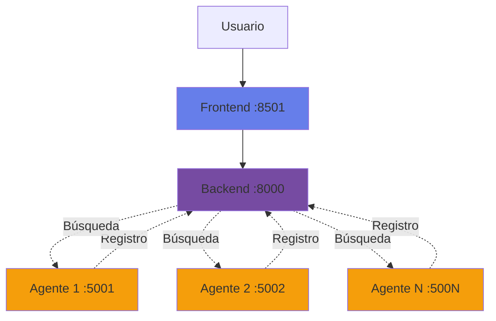
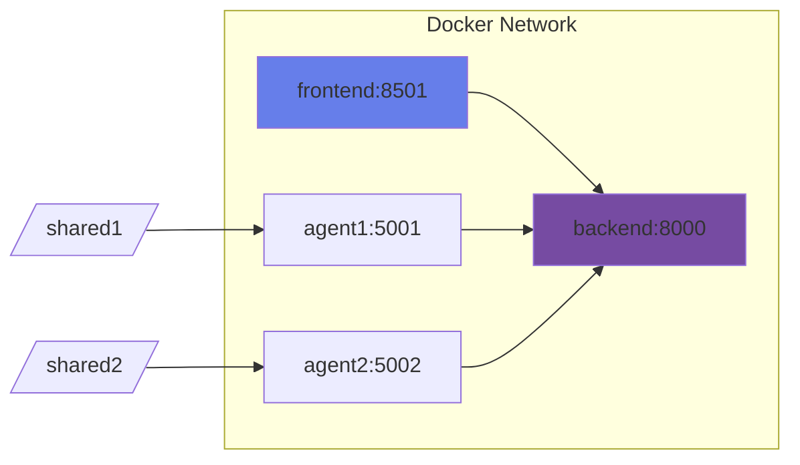
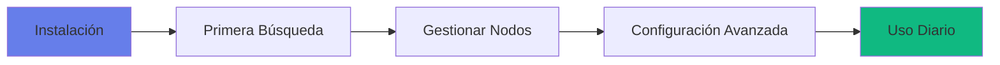
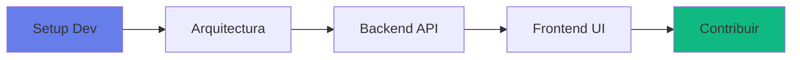
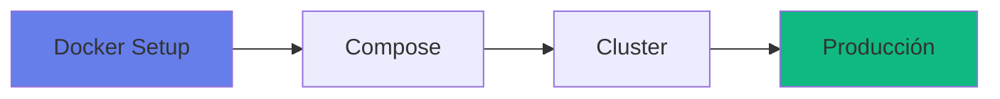

# Comenzar con DistriSearch

<div style="padding: 2rem; background: linear-gradient(135deg, rgba(16, 185, 129, 0.1) 0%, rgba(5, 150, 105, 0.1) 100%); border-radius: 16px; margin-bottom: 2rem; border-left: 4px solid #10b981;">
  <h2 style="margin-top: 0;">🚀 Guía de Inicio Rápido</h2>
  <p>Despliega un cluster Master-Slave de 3 nodos en <strong>menos de 5 minutos</strong>.</p>
</div>

---

## 🐳 Inicio Rápido con Docker Compose

### Opción 1: Cluster Completo (3 Nodos) - Recomendado

```bash
# 1. Clonar repositorio
git clone https://github.com/Pol4720/DS-Project.git
cd DS-Project/DistriSearch/deploy

# 2. Iniciar cluster
docker-compose -f docker-compose.cluster.yml up -d

# 3. Verificar estado
docker-compose -f docker-compose.cluster.yml ps
```

!!! success "URLs de Acceso"
    | Componente | URL |
    |------------|-----|
    | 🎨 Frontend Node 1 | http://localhost:8511 |
    | 🎨 Frontend Node 2 | http://localhost:8512 |
    | 🎨 Frontend Node 3 | http://localhost:8513 |
    | 📚 API Node 1 (Swagger) | http://localhost:8001/docs |
    | 📚 API Node 2 | http://localhost:8002/docs |
    | 📚 API Node 3 | http://localhost:8003/docs |

### Opción 2: Nodo Único (Desarrollo)

```bash
cd DS-Project/DistriSearch/deploy
docker-compose up -d
```

---

## 💻 Instalación Local (Sin Docker)

Para desarrollo o personalización:

=== "1️⃣ Backend"

    ```bash
    cd DS-Project/DistriSearch/backend
    pip install -r requirements.txt
    
    # Configurar variables de entorno
    export NODE_ID=node_1
    export NODE_ROLE=master
    export MONGO_URI=mongodb://localhost:27017
    
    # Iniciar
    python main.py
    ```

=== "2️⃣ Frontend"

    ```bash
    cd DS-Project/DistriSearch/frontend
    pip install -r requirements.txt
    
    # Configurar
    export BACKEND_URL=http://localhost:8000
    
    # Iniciar
    streamlit run app.py
    ```

=== "3️⃣ MongoDB"

    ```bash
    # Con Docker
    docker run -d -p 27017:27017 --name mongo mongo:6
    
    # O instalar localmente
    # https://www.mongodb.com/try/download/community
    ```

---

## 📋 Requisitos del Sistema

### Hardware Mínimo por Nodo

| Componente | Mínimo | Recomendado |
|------------|--------|-------------|
| **CPU** | 2 cores | 4+ cores |
| **RAM** | 4 GB | 8 GB |
| **Disco** | 20 GB HDD | 50 GB SSD |
| **Red** | 10 Mbps | 100 Mbps |

!!! warning "Modelo de Embeddings"
    El modelo `all-MiniLM-L6-v2` requiere ~500 MB de RAM adicional la primera vez que se carga.

### Software Requerido

=== "Linux"

    ```bash
    # Ubuntu/Debian
    sudo apt update
    sudo apt install python3 python3-pip docker.io docker-compose
    
    # Verificar
    python3 --version  # 3.8+
    docker --version
    ```

=== "Windows"

    ```powershell
    # Requerido
    - Python 3.8+ (python.org)
    - Docker Desktop (docker.com)
    
    # Verificar
    python --version
    docker --version
    ```

=== "macOS"

    ```bash
    # Con Homebrew
    brew install python@3.11 docker docker-compose
    
    # Verificar
    python3 --version
    docker --version
    ```
    - Docker Desktop (opcional)
    
    # Verificar instalación
    python --version
    pip --version
    docker --version
    ```

=== "macOS"

    ```bash
    # Instalar Homebrew
    /bin/bash -c "$(curl -fsSL https://raw.githubusercontent.com/Homebrew/install/HEAD/install.sh)"
    
    # Instalar Python
    brew install python@3.11
    
    # Instalar Docker Desktop
    brew install --cask docker
    ```

---

## 🎯 Arquitectura de Despliegue

### Topología Simple (1 Backend + N Agentes)



### Topología con Docker Compose



---

## 🔑 Primeros Pasos

### 1. Verificar Instalación

```bash
# Backend
curl http://localhost:8000/health
# Respuesta: {"status": "ok"}

# Frontend
# Navegar a http://localhost:8501

# Agente
curl http://localhost:5001/health
# Respuesta: {"status": "ok", "node_id": "agent1"}
```

### 2. Registrar Primer Nodo

```bash
# Desde el agente, se registra automáticamente
# O manualmente:
curl -X POST http://localhost:8000/register/ \
  -H "Content-Type: application/json" \
  -d '{
    "node_id": "my-node",
    "name": "Mi Primer Nodo",
    "ip_address": "192.168.1.100",
    "port": 5001
  }'
```

### 3. Indexar Archivos

```bash
# El agente escanea automáticamente cada N minutos
# O forzar escaneo:
curl -X POST http://localhost:5001/scan
```

### 4. Primera Búsqueda

```bash
# Desde frontend o API
curl "http://localhost:8000/search/?q=documento"

# Respuesta:
{
  "files": [
    {
      "file_id": "abc123",
      "name": "documento.pdf",
      "score": 8.5,
      "node": "my-node"
    }
  ],
  "total": 1,
  "query_time_ms": 150
}
```

---

## 📚 Estructura del Proyecto

```
DistriSearch/
├── backend/           # API REST centralizada
│   ├── main.py       # FastAPI app
│   ├── routes/       # Endpoints
│   └── services/     # Lógica de negocio
│
├── frontend/          # Interfaz Streamlit
│   ├── app.py        # Página principal
│   ├── pages/        # Páginas adicionales
│   └── components/   # Componentes UI
│
├── agent/            # Nodo distribuido
│   ├── agent.py      # Orquestador
│   ├── scanner.py    # Escaneo de archivos
│   └── server.py     # API local
│
├── deploy/           # Configuración Docker
│   ├── docker-compose.yml
│   └── docker-stack.yml
│
└── docs/             # Documentación MkDocs
    └── ...
```

---

## 🎓 Rutas de Aprendizaje

### Para Usuarios



1. [Instalación](instalacion.md) - Instalar DistriSearch
2. [Configuración](configuracion.md) - Configurar parámetros
3. [Casos de Uso](../casos-de-uso.md) - Ejemplos reales

### Para Desarrolladores



1. [Arquitectura](../arquitectura.md)
2. [API Reference](../api/index.md)
3. [Características](../caracteristicas.md)

### Para DevOps



1. [Guía de Inicio](index.md)
2. [Instalación](instalacion.md)
3. [Configuración](configuracion.md)

---

## 🆘 Solución de Problemas Comunes

### Backend no inicia

```bash
# Verificar puerto ocupado
netstat -ano | findstr :8000  # Windows
lsof -i :8000                 # Linux/Mac

# Cambiar puerto
uvicorn main:app --port 8080
```

### Agente no se registra

```bash
# Verificar conectividad
ping backend_ip
curl http://backend_ip:8000/health

# Verificar config.yaml
cat agent/config.yaml
# backend.url debe apuntar al backend correcto
```

### Frontend no carga

```bash
# Verificar logs
streamlit run app.py --logger.level=debug

# Limpiar cache
streamlit cache clear
```

### No aparecen archivos

```bash
# Verificar escaneo
curl http://localhost:5001/files

# Forzar escaneo
curl -X POST http://localhost:5001/scan

# Verificar permisos de carpeta
ls -la /ruta/shared_folder
```

---

## 🔗 Enlaces Útiles

| Recurso | Descripción | URL |
|---------|-------------|-----|
| **GitHub** | Código fuente | [Pol4720/DS-Project](https://github.com/Pol4720/DS-Project) |
| **Issues** | Reportar bugs | [GitHub Issues](https://github.com/Pol4720/DS-Project/issues) |
| **Swagger** | API interactiva | `http://localhost:8000/docs` |
| **ReDoc** | API docs | `http://localhost:8000/redoc` |
| **Frontend** | Interfaz web | `http://localhost:8501` |

---

## ✨ Próximos Pasos

<div class="grid cards" markdown>

-   :material-download:{ .lg .middle } __Instalación Detallada__

    ---

    Guía paso a paso para instalar DistriSearch en tu sistema

    [:octicons-arrow-right-24: Ir a Instalación](instalacion.md)

-   :material-cog:{ .lg .middle } __Configuración__

    ---

    Personaliza DistriSearch para tus necesidades

    [:octicons-arrow-right-24: Ir a Configuración](configuracion.md)

-   :material-api:{ .lg .middle } __API Reference__

    ---

    Explora los endpoints disponibles

    [:octicons-arrow-right-24: Ver API](../api/index.md)

-   :material-school:{ .lg .middle } __Casos de Uso__

    ---

    Aprende con ejemplos reales de implementación

    [:octicons-arrow-right-24: Ver Casos de Uso](../casos-de-uso.md)

</div>

---

[:octicons-home-24: Volver al Inicio](../index.md){ .md-button }
[:octicons-arrow-right-24: Comenzar Instalación](instalacion.md){ .md-button .md-button--primary }
