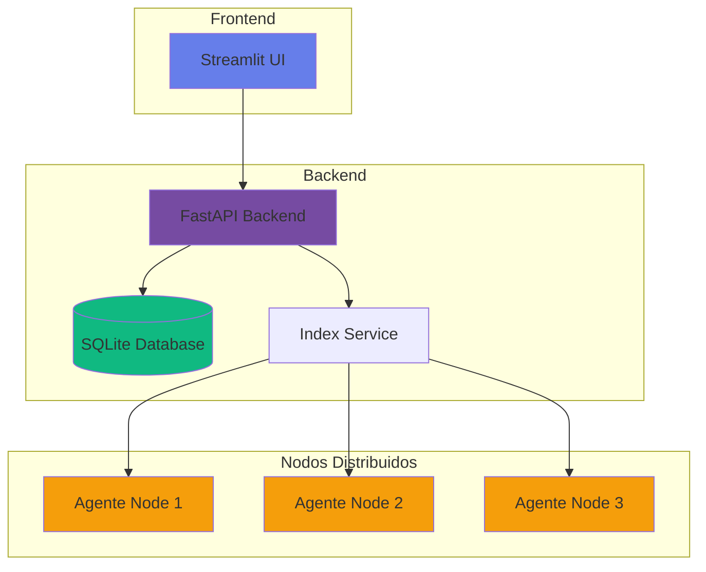

# Bienvenido a DistriSearch

<div style="text-align: center; margin: 2rem 0;">
  
  <h2 style="background: linear-gradient(135deg, #667eea 0%, #764ba2 100%); -webkit-background-clip: text; -webkit-text-fill-color: transparent; font-size: 2.5rem; font-weight: 700;">
    Sistema de Búsqueda Distribuida de Nueva Generación
  </h2>
</div>

---

## 🚀 ¿Qué es DistriSearch?

**DistriSearch** es un sistema de búsqueda distribuida de archivos de código abierto que permite indexar y buscar archivos a través de múltiples nodos en una red P2P (peer-to-peer). Con una arquitectura moderna basada en FastAPI, Streamlit y Docker, DistriSearch ofrece una solución escalable y eficiente para la gestión y búsqueda de archivos en entornos distribuidos.

!!! tip "Características Principales"
    - 🔍 **Búsqueda ultra-rápida** con algoritmo BM25
    - 🌐 **Arquitectura distribuida** escalable
    - 🎨 **Interfaz moderna** con Streamlit
    - 🐳 **Despliegue con Docker** y orquestación
    - 🔒 **Seguridad robusta** con autenticación API
    - 📊 **Monitoreo en tiempo real** de métricas

---

## ✨ Características Destacadas

<div class="grid cards" markdown>

-   :material-lightning-bolt:{ .lg .middle } __Búsqueda Veloz__

    ---

    Algoritmo BM25 optimizado para resultados en milisegundos. Búsqueda por nombre, contenido y metadatos.

    [:octicons-arrow-right-24: Ver más](caracteristicas.md#busqueda-avanzada)

-   :material-network:{ .lg .middle } __Arquitectura Distribuida__

    ---

    Red P2P con nodos autónomos. Escalabilidad horizontal sin límites y tolerancia a fallos integrada.

    [:octicons-arrow-right-24: Ver arquitectura](arquitectura.md)

-   :material-shield-check:{ .lg .middle } __Seguridad Integrada__

    ---

    Autenticación con API keys, CORS configurado y validación de datos con Pydantic.

    [:octicons-arrow-right-24: Ver seguridad](backend/security.md)

-   :material-monitor-dashboard:{ .lg .middle } __Panel de Control__

    ---

    Interfaz web moderna con métricas en tiempo real, gráficos interactivos y gestión de nodos.

    [:octicons-arrow-right-24: Ver frontend](frontend/index.md)

-   :material-docker:{ .lg .middle } __Listo para Producción__

    ---

    Contenedores Docker, Docker Compose y Docker Swarm. Fácil despliegue y escalado.

    [:octicons-arrow-right-24: Ver despliegue](deployment/index.md)

-   :material-api:{ .lg .middle } __API REST Completa__

    ---

    Documentación interactiva con Swagger, endpoints bien definidos y respuestas consistentes.

    [:octicons-arrow-right-24: Ver API](api/index.md)

</div>

---

## 🎯 ¿Para qué sirve DistriSearch?

DistriSearch es ideal para:

- **Organizaciones** que necesitan buscar archivos distribuidos en múltiples servidores
- **Equipos de desarrollo** que comparten recursos entre diferentes ubicaciones
- **Centros de datos** que requieren un sistema de búsqueda centralizado
- **Proyectos colaborativos** donde los archivos están dispersos
- **Entornos de investigación** con grandes volúmenes de datos

---

## 🏗️ Arquitectura del Sistema



---

## 🚀 Inicio Rápido

### Instalación en 3 Pasos

=== "1️⃣ Clonar Repositorio"

    ```bash
    git clone https://github.com/Pol4720/DS-Project.git
    cd DS-Project/DistriSearch
    ```

=== "2️⃣ Configurar Entorno"

    ```bash
    # Backend
    cd backend
    pip install -r requirements.txt
    
    # Frontend
    cd ../frontend
    pip install -r requirements.txt
    
    # Agente
    cd ../agent
    pip install -r requirements.txt
    ```

=== "3️⃣ Ejecutar Sistema"

    ```bash
    # Terminal 1: Backend
    cd backend
    python main.py
    
    # Terminal 2: Frontend
    cd frontend
    streamlit run app.py
    
    # Terminal 3: Agente (opcional)
    cd agent
    python agent.py
    ```

!!! success "¡Listo!"
    Accede a:
    
    - **Frontend**: [http://localhost:8501](http://localhost:8501)
    - **Backend API**: [http://localhost:8000](http://localhost:8000)
    - **Swagger Docs**: [http://localhost:8000/docs](http://localhost:8000/docs)

[:octicons-arrow-right-24: Guía de instalación completa](getting-started/instalacion.md)

---

## 📚 Documentación por Componente

<div class="grid" markdown>

=== "Backend"

    ### 🔧 Backend API
    
    FastAPI con endpoints REST para búsqueda, registro y descarga.
    
    - [Introducción al Backend](backend/index.md)
    - [API REST](backend/api.md)
    - [Base de Datos](backend/database.md)
    - [Servicios](backend/services.md)
    
=== "Frontend"

    ### 🎨 Frontend Web
    
    Interfaz moderna con Streamlit y componentes personalizados.
    
    - [Introducción al Frontend](frontend/index.md)
    - [Componentes UI](frontend/componentes.md)
    - [Páginas](frontend/paginas.md)
    - [Estilos y Temas](frontend/estilos.md)

=== "Agente"

    ### 🤖 Agente de Nodo
    
    Servicio que indexa y comparte archivos de cada nodo.
    
    - [Introducción al Agente](agent/index.md)
    - [Funcionamiento](agent/funcionamiento.md)
    - [Scanner de Archivos](agent/scanner.md)
    - [API del Agente](agent/api.md)

=== "Despliegue"

    ### 🐳 Despliegue
    
    Docker, Docker Compose y Docker Swarm para producción.
    
    - [Introducción al Despliegue](deployment/index.md)
    - [Docker](deployment/docker.md)
    - [Docker Compose](deployment/docker-compose.md)
    - [Docker Swarm](deployment/docker-swarm.md)

</div>

---

## 📊 Métricas del Proyecto

| Componente | Tecnología | Líneas de Código | Endpoints |
|------------|------------|------------------|-----------|
| Backend | FastAPI | ~2,000 | 15+ |
| Frontend | Streamlit | ~2,500 | N/A |
| Agente | FastAPI | ~800 | 5+ |
| Documentación | MkDocs | ~5,000 | N/A |

---

## 🤝 Contribuir

DistriSearch es un proyecto de código abierto y agradecemos las contribuciones de la comunidad.

!!! example "Formas de Contribuir"
    - 🐛 Reportar bugs
    - ✨ Proponer nuevas características
    - 📝 Mejorar la documentación
    - 🔧 Enviar pull requests
    - ⭐ Dar una estrella en GitHub

[:octicons-mark-github-16: Ver en GitHub](https://github.com/Pol4720/DS-Project){ .md-button .md-button--primary }
[:octicons-book-16: Guía de Contribución](development/contribucion.md){ .md-button }

---

## 📞 Soporte y Contacto

- **GitHub Issues**: [Reportar un problema](https://github.com/Pol4720/DS-Project/issues)
- **Documentación**: Esta página
- **FAQ**: [Preguntas Frecuentes](faq.md)

---

## 📜 Licencia

DistriSearch está licenciado bajo la licencia MIT. Consulta el archivo [LICENSE](license.md) para más detalles.

---

<div style="text-align: center; margin: 3rem 0; padding: 2rem; background: linear-gradient(135deg, rgba(102, 126, 234, 0.1) 0%, rgba(118, 75, 162, 0.1) 100%); border-radius: 16px;">
  <h3>¿Listo para empezar?</h3>
  <p style="font-size: 1.1rem; margin: 1rem 0;">
    Explora la documentación y comienza a usar DistriSearch hoy mismo.
  </p>
  <a href="getting-started/index.md" class="md-button md-button--primary" style="margin: 0.5rem;">
    🚀 Comenzar Ahora
  </a>
  <a href="tutorials/index.md" class="md-button" style="margin: 0.5rem;">
    📚 Ver Tutoriales
  </a>
</div>
