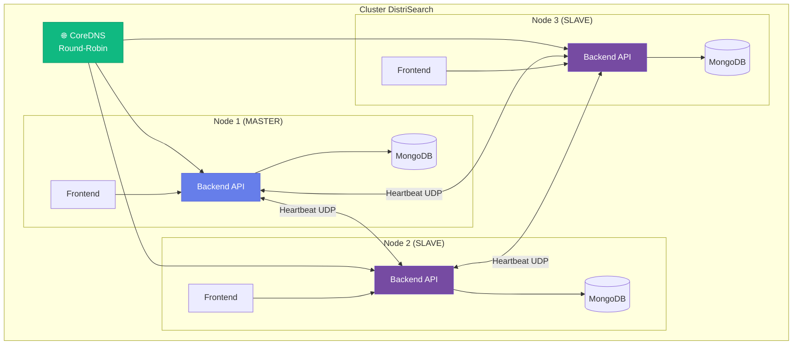

# Bienvenido a DistriSearch

<div class="hero-section" style="text-align: center; margin: 2rem 0; padding: 3rem 2rem; background: linear-gradient(135deg, rgba(102, 126, 234, 0.1) 0%, rgba(118, 75, 162, 0.1) 100%); border-radius: 24px; border: 1px solid rgba(102, 126, 234, 0.2);">
  
  <h2 style="background: linear-gradient(135deg, #667eea 0%, #764ba2 100%); -webkit-background-clip: text; -webkit-text-fill-color: transparent; font-size: 2.5rem; font-weight: 800; margin-bottom: 0.5rem;">
    Sistema de Búsqueda Distribuida
  </h2>
  <p style="font-size: 1.2rem; color: #666; margin: 1rem 0 2rem 0;">
    Arquitectura <strong>Master-Slave</strong> con ubicación semántica y alta disponibilidad
  </p>
  <div style="display: flex; gap: 1rem; justify-content: center; flex-wrap: wrap;">
    <a href="getting-started/index.md" class="md-button md-button--primary" style="padding: 0.8rem 2rem; font-size: 1.1rem;">
      🚀 Comenzar Ahora
    </a>
    <a href="arquitectura.md" class="md-button" style="padding: 0.8rem 2rem; font-size: 1.1rem;">
      📐 Ver Arquitectura
    </a>
  </div>
</div>

---

## 🚀 ¿Qué es DistriSearch?

**DistriSearch** es un sistema de búsqueda distribuida de archivos de código abierto basado en arquitectura **Master-Slave** con:

- 🧠 **Ubicación semántica** de recursos mediante embeddings
- 👑 **Elección dinámica de líder** con algoritmo Bully
- 💓 **Sistema de heartbeats** para detección de fallos
- 🔄 **Replicación inteligente** por afinidad semántica

!!! success "Características v2.0 - Master-Slave"
    - 🔍 **Búsqueda semántica** con sentence-transformers
    - 🌐 **Cluster distribuido** con CoreDNS
    - ⚡ **Failover automático** en ~15 segundos
    - 🎨 **Interfaz moderna** con Streamlit
    - 🐳 **Docker Compose** para cluster de 3 nodos
    - 📊 **Métricas MTTR/MTBF** de confiabilidad

---

## ✨ Características Destacadas

<div class="grid cards" markdown>

-   :material-brain:{ .lg .middle } __Ubicación Semántica__

    ---

    Localiza recursos por similitud de contenido usando embeddings de `sentence-transformers`. Sin tablas hash.

    [:octicons-arrow-right-24: Ver más](caracteristicas.md#busqueda-avanzada)

-   :material-crown:{ .lg .middle } __Elección de Líder__

    ---

    Algoritmo Bully para elección automática de Master. Cualquier nodo puede ser líder ante fallos.

    [:octicons-arrow-right-24: Ver arquitectura](arquitectura.md)

-   :material-heart-pulse:{ .lg .middle } __Heartbeats UDP__

    ---

    Detección de fallos en ~15 segundos. Sistema de monitoreo con métricas MTTR/MTBF.

    [:octicons-arrow-right-24: Ver tolerancia](caracteristicas.md#tolerancia-a-fallos)

-   :material-content-copy:{ .lg .middle } __Replicación Inteligente__

    ---

    Réplicas en nodos con contenido semánticamente similar. Factor K=2 configurable.

    [:octicons-arrow-right-24: Ver replicación](caracteristicas.md#replicacion-por-afinidad-semantica)

-   :material-dns:{ .lg .middle } __CoreDNS Integrado__

    ---

    Resolución DNS con failover automático. Round-robin entre nodos disponibles.

    [:octicons-arrow-right-24: Ver arquitectura](arquitectura.md)

-   :material-api:{ .lg .middle } __Health Checks__

    ---

    Endpoints de salud para Kubernetes: liveness, readiness y métricas de cluster.

    [:octicons-arrow-right-24: Ver API](api/index.md)

</div>

---

## 🎯 ¿Para qué sirve DistriSearch?

DistriSearch es ideal para:

- **Organizaciones** que necesitan buscar archivos distribuidos en múltiples servidores
- **Equipos de desarrollo** que comparten recursos entre diferentes ubicaciones
- **Centros de datos** que requieren un sistema de búsqueda centralizado
- **Proyectos colaborativos** donde los archivos están dispersos
- **Entornos de investigación** con grandes volúmenes de datos

---

## 🏗️ Arquitectura Master-Slave



!!! info "¿Por qué Master-Slave?"
    - **Sin DHT ni hipercubo**: Ubicación semántica basada en embeddings
    - **Elección dinámica**: Cualquier nodo puede ser Master (Bully Algorithm)
    - **Alta disponibilidad**: Failover automático en ~15 segundos
    - **Replicación inteligente**: Por afinidad de contenido, no por hash

---

## 🚀 Inicio Rápido

### Despliegue con Docker Compose (Recomendado)

=== "🐳 Cluster Completo (3 Nodos)"

    ```bash
    # Clonar repositorio
    git clone https://github.com/Pol4720/DS-Project.git
    cd DS-Project/DistriSearch/deploy
    
    # Levantar cluster
    docker-compose -f docker-compose.cluster.yml up -d
    ```
    
    **URLs de acceso:**
    
    | Componente | URL |
    |------------|-----|
    | Frontend Node 1 | http://localhost:8511 |
    | Frontend Node 2 | http://localhost:8512 |
    | Frontend Node 3 | http://localhost:8513 |
    | API Node 1 | http://localhost:8001/docs |

=== "💻 Desarrollo Local"

    ```bash
    cd DS-Project/DistriSearch/deploy
    
    # Un solo nodo para desarrollo
    docker-compose up -d
    ```

=== "🐍 Sin Docker"

    ```bash
    # Backend
    cd backend
    pip install -r requirements.txt
    python main.py
    
    # Frontend (otra terminal)
    cd frontend
    pip install -r requirements.txt
    streamlit run app.py
    ```

!!! success "¡Listo!"
    El cluster está funcionando con:
    
    - ✅ **3 nodos** con elección automática de Master
    - ✅ **CoreDNS** para resolución con failover
    - ✅ **Heartbeats UDP** cada 5 segundos
    - ✅ **MongoDB** replicado por nodo

[:octicons-arrow-right-24: Guía de instalación completa](getting-started/instalacion.md)

---

## 📚 Documentación

<div class="grid" markdown>

=== "🔧 Backend API"
    
    FastAPI con endpoints REST para búsqueda, registro y descarga.
    
    - [API Reference](api/index.md)
    - [Arquitectura](arquitectura.md)
    
=== "🎨 Frontend"
    
    Interfaz moderna con Streamlit y componentes personalizados.
    
    - [Características](caracteristicas.md)
    - [Casos de Uso](casos-de-uso.md)

=== "🚀 Despliegue"
    
    Docker Compose para cluster de producción.
    
    - [Guía de Inicio](getting-started/index.md)
    - [Instalación](getting-started/instalacion.md)
    - [Configuración](getting-started/configuracion.md)

</div>

---

## 📊 Stack Tecnológico

| Componente | Tecnología | Descripción |
|------------|------------|-------------|
| Backend | FastAPI + MongoDB | API REST con base de datos NoSQL |
| Frontend | Streamlit | Interfaz web interactiva |
| Embeddings | sentence-transformers | Ubicación semántica |
| DNS | CoreDNS | Resolución con failover |
| Contenedores | Docker Compose | Orquestación de cluster |

---

## 🤝 Contribuir

DistriSearch es un proyecto de código abierto y agradecemos las contribuciones de la comunidad.

!!! example "Formas de Contribuir"
    - 🐛 Reportar bugs
    - ✨ Proponer nuevas características
    - 📝 Mejorar la documentación
    - 🔧 Enviar pull requests
    - ⭐ Dar una estrella en GitHub

[:octicons-mark-github-16: Ver en GitHub](https://github.com/Pol4720/DS-Project){ .md-button .md-button--primary }

---

## 📞 Soporte y Contacto

- **GitHub Issues**: [Reportar un problema](https://github.com/Pol4720/DS-Project/issues)
- **Documentación**: Esta página
- **FAQ**: [Preguntas Frecuentes](faq.md)

---

<div style="text-align: center; margin: 3rem 0; padding: 2rem; background: linear-gradient(135deg, rgba(102, 126, 234, 0.1) 0%, rgba(118, 75, 162, 0.1) 100%); border-radius: 16px;">
  <h3>¿Listo para empezar?</h3>
  <p style="font-size: 1.1rem; margin: 1rem 0;">
    Explora la documentación y comienza a usar DistriSearch hoy mismo.
  </p>
  <a href="getting-started/index.md" class="md-button md-button--primary" style="margin: 0.5rem;">
    🚀 Comenzar Ahora
  </a>
  <a href="api/index.md" class="md-button" style="margin: 0.5rem;">
    📚 Ver API
  </a>
</div>
