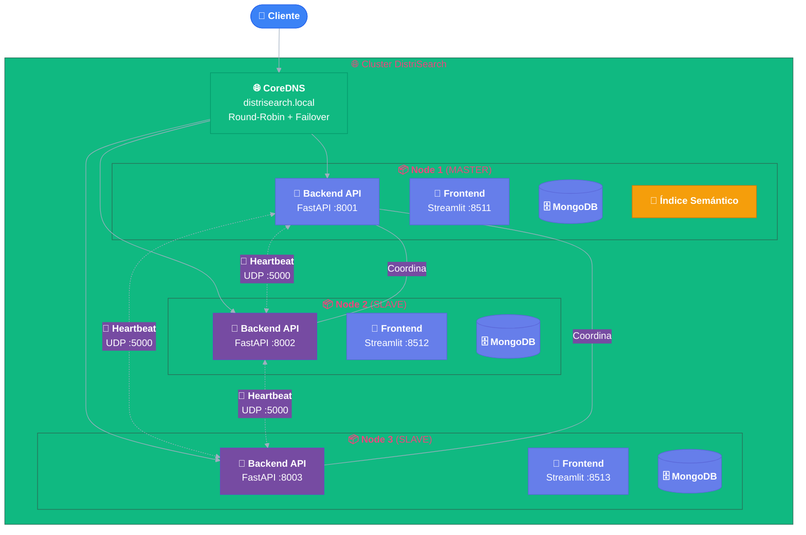

# 🔍 DistriSearch

<div class="hero-section" style="text-align: center; margin: 2rem 0; padding: 3rem 2rem; background: linear-gradient(135deg, rgba(102, 126, 234, 0.1) 0%, rgba(118, 75, 162, 0.1) 100%); border-radius: 24px; border: 1px solid rgba(102, 126, 234, 0.2);">
  
  
  <h2 style="background: linear-gradient(135deg, #667eea 0%, #764ba2 100%); -webkit-background-clip: text; -webkit-text-fill-color: transparent; font-size: 2.8rem; font-weight: 800; margin-bottom: 0.5rem;">
    Sistema de Búsqueda Distribuida
  </h2>
  
  <p style="font-size: 1.3rem; color: #718096; margin: 1rem 0 1.5rem 0; max-width: 600px; margin-left: auto; margin-right: auto;">
    Arquitectura <strong style="color: #667eea;">Master-Slave</strong> con ubicación semántica y alta disponibilidad
  </p>
  
  <div style="display: flex; gap: 0.5rem; justify-content: center; flex-wrap: wrap; margin-bottom: 1.5rem;">
    <span style="background: linear-gradient(135deg, #667eea, #764ba2); color: white; padding: 0.3rem 0.8rem; border-radius: 20px; font-size: 0.85rem; font-weight: 600;">v2.0</span>
    <span style="background: #10b981; color: white; padding: 0.3rem 0.8rem; border-radius: 20px; font-size: 0.85rem; font-weight: 600;">✓ Open Source</span>
    <span style="background: #f59e0b; color: white; padding: 0.3rem 0.8rem; border-radius: 20px; font-size: 0.85rem; font-weight: 600;">🐍 Python</span>
    <span style="background: #3b82f6; color: white; padding: 0.3rem 0.8rem; border-radius: 20px; font-size: 0.85rem; font-weight: 600;">🐳 Docker Ready</span>
  </div>
  
  <div style="display: flex; gap: 1rem; justify-content: center; flex-wrap: wrap;">
    <a href="getting-started/index.md" class="md-button md-button--primary" style="padding: 0.9rem 2.2rem; font-size: 1.1rem; border-radius: 12px;">
      🚀 Comenzar Ahora
    </a>
    <a href="arquitectura.md" class="md-button" style="padding: 0.9rem 2.2rem; font-size: 1.1rem; border-radius: 12px;">
      📐 Ver Arquitectura
    </a>
    <a href="https://github.com/Pol4720/DS-Project" class="md-button" style="padding: 0.9rem 2.2rem; font-size: 1.1rem; border-radius: 12px;">
      :material-github: GitHub
    </a>
  </div>
</div>

---

## 🚀 ¿Qué es DistriSearch?

<div style="display: grid; grid-template-columns: 1fr 1fr; gap: 2rem; margin: 2rem 0;">
<div>

**DistriSearch** es un sistema de búsqueda distribuida de archivos de código abierto diseñado para entornos empresariales y académicos. Basado en arquitectura **Master-Slave con elección dinámica**, ofrece:

- 🧠 **Ubicación semántica** mediante embeddings vectoriales
- 👑 **Elección dinámica de líder** con algoritmo Bully
- 💓 **Sistema de heartbeats** para detección de fallos
- 🔄 **Replicación inteligente** por afinidad semántica

</div>
<div>

!!! abstract "Stack Tecnológico"
    | Componente | Tecnología |
    |------------|------------|
    | **Backend** | FastAPI + MongoDB |
    | **Frontend** | Streamlit |
    | **Embeddings** | sentence-transformers |
    | **DNS** | CoreDNS |
    | **Deploy** | Docker Swarm |

</div>
</div>

!!! tip "Novedades v2.0 - Arquitectura Master-Slave"
    <div style="display: grid; grid-template-columns: repeat(3, 1fr); gap: 1rem; margin-top: 1rem;">
    <div style="text-align: center; padding: 1rem; background: rgba(16, 185, 129, 0.1); border-radius: 12px;">
        <span style="font-size: 2rem;">🔍</span><br/>
        <strong>Búsqueda Semántica</strong><br/>
        <small>sentence-transformers</small>
    </div>
    <div style="text-align: center; padding: 1rem; background: rgba(102, 126, 234, 0.1); border-radius: 12px;">
        <span style="font-size: 2rem;">⚡</span><br/>
        <strong>Failover ~15s</strong><br/>
        <small>Algoritmo Bully</small>
    </div>
    <div style="text-align: center; padding: 1rem; background: rgba(118, 75, 162, 0.1); border-radius: 12px;">
        <span style="font-size: 2rem;">📊</span><br/>
        <strong>Métricas MTTR/MTBF</strong><br/>
        <small>Observabilidad</small>
    </div>
    </div>

---

## ✨ Características Principales

<div class="grid cards" markdown>

-   :material-brain:{ .lg .middle } **Ubicación Semántica**

    ---
    
    Localiza recursos por **similitud de contenido** usando embeddings de 384 dimensiones. Sin DHT ni tablas hash.
    
    ```python
    # Embedding del documento
    vector = model.encode("Algoritmos de ML")
    # Similitud coseno para encontrar relacionados
    similar_docs = find_by_cosine(vector, k=10)
    ```

    [:octicons-arrow-right-24: Ver detalles](caracteristicas.md#busqueda-avanzada)

-   :material-crown:{ .lg .middle } **Elección Dinámica de Líder**

    ---
    
    Algoritmo **Bully** para elección automática de Master. Cualquier nodo puede convertirse en líder.
    
    - ID mayor → nuevo Master
    - Elección en ~10-15 segundos
    - Sin punto único de fallo

    [:octicons-arrow-right-24: Ver arquitectura](arquitectura.md)

-   :material-heart-pulse:{ .lg .middle } **Heartbeats UDP**

    ---
    
    Detección de fallos mediante heartbeats UDP cada **5 segundos**. Timeout configurable.
    
    | Parámetro | Valor |
    |-----------|-------|
    | Intervalo | 5s |
    | Timeout | 15s |
    | Puerto | 5000 |

    [:octicons-arrow-right-24: Ver tolerancia](caracteristicas.md#tolerancia-a-fallos)

-   :material-content-copy:{ .lg .middle } **Replicación por Afinidad**

    ---
    
    Réplicas en nodos con **contenido semánticamente similar**. Factor K=2 configurable.
    
    - Distribución inteligente
    - Menor latencia de acceso
    - Balanceo automático

    [:octicons-arrow-right-24: Ver replicación](caracteristicas.md#replicacion-por-afinidad-semantica)

-   :material-dns:{ .lg .middle } **CoreDNS Integrado**

    ---
    
    Resolución DNS con failover automático y round-robin entre nodos saludables.
    
    ```bash
    # Acceso mediante DNS
    curl http://distrisearch.local/search
    # CoreDNS redirige a nodo disponible
    ```

    [:octicons-arrow-right-24: Ver Arquitectura](arquitectura.md)

-   :material-api:{ .lg .middle } **Health Checks Completos**

    ---
    
    Endpoints de salud para **Kubernetes y Docker**: liveness, readiness y métricas.
    
    ```http
    GET /health/live     # Liveness probe
    GET /health/ready    # Readiness probe
    GET /health/cluster  # Estado del cluster
    ```

    [:octicons-arrow-right-24: Ver API](api/index.md)

</div>

---

## 🎯 Casos de Uso Ideales

<div style="display: grid; grid-template-columns: repeat(auto-fit, minmax(280px, 1fr)); gap: 1.5rem; margin: 2rem 0;">

<div style="padding: 1.5rem; background: linear-gradient(135deg, rgba(102, 126, 234, 0.08) 0%, rgba(118, 75, 162, 0.08) 100%); border-radius: 16px; border: 1px solid rgba(102, 126, 234, 0.15);">
  <span style="font-size: 2.5rem;">🏢</span>
  <h4 style="margin: 0.5rem 0;">Empresas Distribuidas</h4>
  <p style="color: #718096; margin: 0;">Oficinas en múltiples ubicaciones con necesidad de búsqueda unificada de documentos.</p>
</div>

<div style="padding: 1.5rem; background: linear-gradient(135deg, rgba(16, 185, 129, 0.08) 0%, rgba(5, 150, 105, 0.08) 100%); border-radius: 16px; border: 1px solid rgba(16, 185, 129, 0.15);">
  <span style="font-size: 2.5rem;">🎓</span>
  <h4 style="margin: 0.5rem 0;">Instituciones Académicas</h4>
  <p style="color: #718096; margin: 0;">Universidades con repositorios departamentales de tesis, papers y recursos.</p>
</div>

<div style="padding: 1.5rem; background: linear-gradient(135deg, rgba(245, 158, 11, 0.08) 0%, rgba(217, 119, 6, 0.08) 100%); border-radius: 16px; border: 1px solid rgba(245, 158, 11, 0.15);">
  <span style="font-size: 2.5rem;">💻</span>
  <h4 style="margin: 0.5rem 0;">Equipos de Desarrollo</h4>
  <p style="color: #718096; margin: 0;">Búsqueda de código y documentación técnica en arquitecturas microservicios.</p>
</div>

<div style="padding: 1.5rem; background: linear-gradient(135deg, rgba(239, 68, 68, 0.08) 0%, rgba(220, 38, 38, 0.08) 100%); border-radius: 16px; border: 1px solid rgba(239, 68, 68, 0.15);">
  <span style="font-size: 2.5rem;">🏥</span>
  <h4 style="margin: 0.5rem 0;">Sector Salud</h4>
  <p style="color: #718096; margin: 0;">Búsqueda de historiales médicos respetando privacidad y localidad de datos.</p>
</div>

</div>

---

## 🏗️ Arquitectura del Sistema



!!! info "¿Por qué Master-Slave con Elección Dinámica?"
    <div style="display: grid; grid-template-columns: 1fr 1fr; gap: 1rem; margin-top: 1rem;">
    <div>
    **✅ Ventajas:**
    
    - Sin DHT ni hipercubo complejo
    - Ubicación semántica basada en embeddings
    - Cualquier nodo puede ser Master (Bully)
    - Failover automático en ~15 segundos
    </div>
    <div>
    **🔧 Características:**
    
    - Replicación por afinidad de contenido
    - CoreDNS para balanceo
    - Heartbeats UDP ligeros
    - Métricas de confiabilidad
    </div>
    </div>

---

## 🚀 Inicio Rápido

<div style="background: linear-gradient(135deg, rgba(16, 185, 129, 0.1) 0%, rgba(5, 150, 105, 0.1) 100%); padding: 1.5rem; border-radius: 16px; margin: 1rem 0; border-left: 4px solid #10b981;">
<strong>⏱️ Tiempo estimado:</strong> 3-5 minutos | <strong>Requisitos:</strong> Docker + Docker Compose
</div>

=== "🐳 Cluster Completo (3 Nodos)"

    ```bash
    # 1️⃣ Clonar repositorio
    git clone https://github.com/Pol4720/DS-Project.git
    cd DS-Project/DistriSearch/deploy
    
    # 2️⃣ Levantar cluster completo
    docker-compose -f docker-compose.cluster.yml up -d
    
    # 3️⃣ Verificar estado
    docker-compose -f docker-compose.cluster.yml ps
    ```
    
    !!! success "URLs de Acceso"
        | Servicio | URL | Descripción |
        |----------|-----|-------------|
        | 🎨 Frontend 1 | `http://localhost:8511` | Interfaz principal |
        | 🎨 Frontend 2 | `http://localhost:8512` | Nodo réplica |
        | 🎨 Frontend 3 | `http://localhost:8513` | Nodo réplica |
        | 📚 API Docs | `http://localhost:8001/docs` | Swagger UI |

=== "💻 Desarrollo Local"

    ```bash
    cd DS-Project/DistriSearch/deploy
    
    # Un solo nodo para desarrollo
    docker-compose up -d
    
    # Acceder a: http://localhost:8501
    ```

=== "🐍 Sin Docker"

    ```bash
    # Terminal 1: Backend
    cd backend
    pip install -r requirements.txt
    export NODE_ID=node_1 NODE_ROLE=master
    python main.py
    
    # Terminal 2: Frontend
    cd frontend
    pip install -r requirements.txt
    streamlit run app.py
    ```

!!! tip "El cluster está funcionando"
    - ✅ **3 nodos** con elección automática de Master
    - ✅ **CoreDNS** para resolución con failover
    - ✅ **Heartbeats UDP** cada 5 segundos
    - ✅ **MongoDB** replicado por nodo

[:octicons-arrow-right-24: Guía de instalación completa](getting-started/instalacion.md){ .md-button }
[:octicons-arrow-right-24: Despliegue con Docker Swarm](getting-started/docker-swarm-deployment.md){ .md-button }

---

## 📚 Explora la Documentación

<div style="display: grid; grid-template-columns: repeat(auto-fit, minmax(300px, 1fr)); gap: 1.5rem; margin: 2rem 0;">

<div style="padding: 1.5rem; background: linear-gradient(135deg, rgba(102, 126, 234, 0.08) 0%, rgba(118, 75, 162, 0.08) 100%); border-radius: 16px; border: 1px solid rgba(102, 126, 234, 0.15);">
  <h4 style="margin-top: 0;">🔧 Backend API</h4>
  <p style="color: #718096; margin-bottom: 1rem;">FastAPI con endpoints REST para búsqueda, registro y descarga.</p>
  <a href="api/index.md" style="color: #667eea; font-weight: 600;">Ver API Reference →</a>
</div>

<div style="padding: 1.5rem; background: linear-gradient(135deg, rgba(16, 185, 129, 0.08) 0%, rgba(5, 150, 105, 0.08) 100%); border-radius: 16px; border: 1px solid rgba(16, 185, 129, 0.15);">
  <h4 style="margin-top: 0;">📐 Arquitectura</h4>
  <p style="color: #718096; margin-bottom: 1rem;">Diagramas, componentes y flujos del sistema distribuido.</p>
  <a href="arquitectura.md" style="color: #10b981; font-weight: 600;">Ver Arquitectura →</a>
</div>

<div style="padding: 1.5rem; background: linear-gradient(135deg, rgba(245, 158, 11, 0.08) 0%, rgba(217, 119, 6, 0.08) 100%); border-radius: 16px; border: 1px solid rgba(245, 158, 11, 0.15);">
  <h4 style="margin-top: 0;">🚀 Despliegue</h4>
  <p style="color: #718096; margin-bottom: 1rem;">Docker Compose, Docker Swarm y configuración avanzada.</p>
  <a href="getting-started/instalacion.md" style="color: #f59e0b; font-weight: 600;">Ver Instalación →</a>
</div>

</div>

---

## 📊 Stack Tecnológico

<div style="overflow-x: auto;">

| Componente | Tecnología | Versión | Descripción |
|:-----------|:-----------|:--------|:------------|
| :material-api: **Backend** | FastAPI + MongoDB | 0.109+ / 6.0+ | API REST asíncrona con base de datos NoSQL |
| :material-monitor: **Frontend** | Streamlit | 1.32+ | Interfaz web interactiva con componentes modernos |
| :material-brain: **Embeddings** | sentence-transformers | all-MiniLM-L6-v2 | Vectores semánticos de 384 dimensiones |
| :material-dns: **DNS** | CoreDNS | 1.11+ | Resolución con failover y round-robin |
| :material-docker: **Contenedores** | Docker Swarm | 24.0+ | Orquestación para producción multi-nodo |

</div>

---

## 🤝 Contribuir al Proyecto

<div style="display: grid; grid-template-columns: 1fr 1fr; gap: 2rem; margin: 2rem 0;">
<div>

DistriSearch es **100% open source** y agradecemos las contribuciones:

- 🐛 Reportar bugs y problemas
- ✨ Proponer nuevas características  
- 📝 Mejorar la documentación
- 🔧 Enviar pull requests
- ⭐ Dar una estrella en GitHub

</div>
<div style="display: flex; flex-direction: column; gap: 0.5rem;">

[:octicons-mark-github-16: Ver en GitHub](https://github.com/Pol4720/DS-Project){ .md-button .md-button--primary style="text-align: center;" }

[:octicons-issue-opened-16: Reportar un Issue](https://github.com/Pol4720/DS-Project/issues){ .md-button style="text-align: center;" }

[:octicons-question-16: Preguntas Frecuentes](faq.md){ .md-button style="text-align: center;" }

</div>
</div>

---

<div style="text-align: center; margin: 3rem 0; padding: 2.5rem; background: linear-gradient(135deg, rgba(102, 126, 234, 0.15) 0%, rgba(118, 75, 162, 0.15) 100%); border-radius: 24px;">
  <h2 style="background: linear-gradient(135deg, #667eea 0%, #764ba2 100%); -webkit-background-clip: text; -webkit-text-fill-color: transparent; margin-top: 0;">¿Listo para comenzar?</h2>
  <p style="font-size: 1.2rem; margin: 1rem 0 1.5rem 0; color: #718096;">
    Despliega tu primer cluster de búsqueda distribuida en minutos.
  </p>
  <div style="display: flex; gap: 1rem; justify-content: center; flex-wrap: wrap;">
    <a href="getting-started/index.md" class="md-button md-button--primary" style="padding: 0.9rem 2rem; font-size: 1.1rem; border-radius: 12px;">
      🚀 Comenzar Ahora
    </a>
    <a href="api/index.md" class="md-button" style="padding: 0.9rem 2rem; font-size: 1.1rem; border-radius: 12px;">
      📚 Ver API
    </a>
  </div>
</div>
