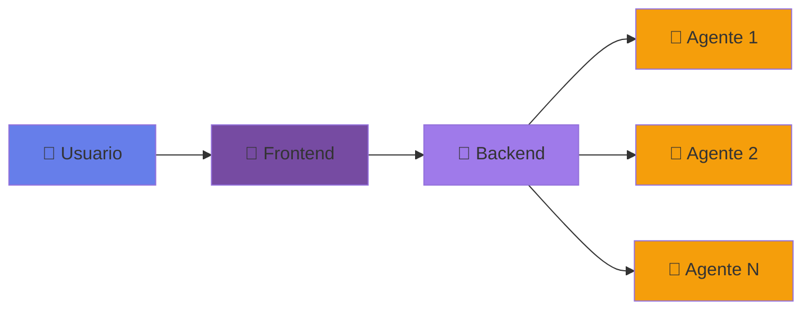
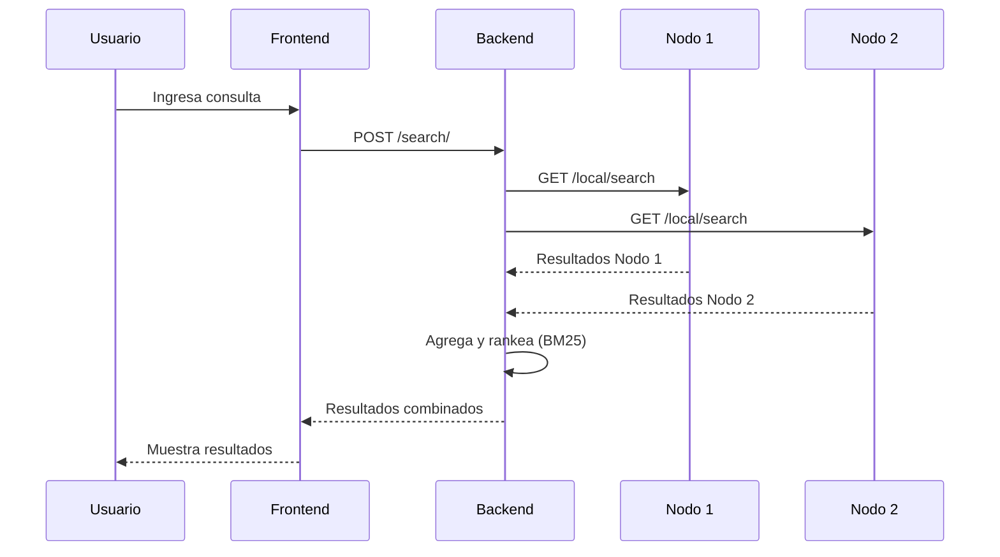
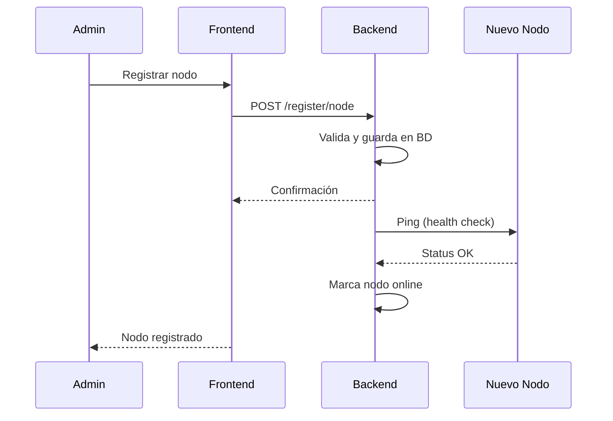
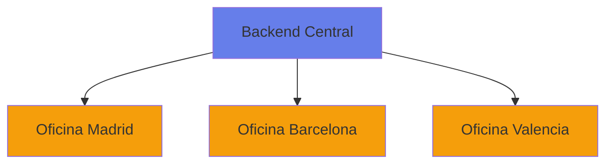

# Introducción a DistriSearch

## 📖 Visión General

**DistriSearch** es un sistema de búsqueda distribuida diseñado para resolver el desafío de localizar archivos en entornos donde los datos están dispersos en múltiples nodos o servidores. A diferencia de los sistemas de búsqueda tradicionales centralizados, DistriSearch utiliza una arquitectura peer-to-peer (P2P) que permite a cada nodo mantener su propio índice de archivos mientras participa en una red colaborativa de búsqueda.

---

## 🎯 Objetivo del Proyecto

El objetivo principal de DistriSearch es proporcionar una solución **moderna**, **escalable** y **eficiente** para la búsqueda de archivos en entornos distribuidos, permitiendo:

- ✅ Búsqueda rápida y precisa de archivos en múltiples nodos
- ✅ Escalabilidad horizontal sin límites teóricos
- ✅ Tolerancia a fallos con replicación automática
- ✅ Interfaz de usuario intuitiva y moderna
- ✅ Fácil despliegue y mantenimiento

---

## 🏛️ Arquitectura de Alto Nivel

DistriSearch está compuesto por tres componentes principales:

### 1. Frontend (Streamlit)

Interfaz web moderna y responsiva que permite a los usuarios:

- Realizar búsquedas de archivos
- Gestionar nodos de la red
- Visualizar estadísticas y métricas
- Configurar el sistema

**Tecnologías**: Streamlit, Plotly, Python

### 2. Backend (FastAPI)

API REST centralizada que coordina:

- Búsquedas distribuidas a través de todos los nodos
- Registro y gestión de nodos
- Descarga de archivos
- Replicación y tolerancia a fallos
- Índice central (modo centralizado)

**Tecnologías**: FastAPI, SQLite, SQLAlchemy, Pydantic

### 3. Agentes (Nodos)

Servicios independientes que ejecutan en cada nodo:

- Escaneo automático de carpetas locales
- Indexación de archivos con metadatos
- API REST para consultas locales
- Sincronización con el backend central

**Tecnologías**: FastAPI, Python, Threading

---

## 🔄 Flujo de Trabajo

### Proceso de Búsqueda

### Proceso de Registro de Nodo

---

## 💡 Conceptos Clave

### Búsqueda Distribuida

En lugar de mantener un índice centralizado de todos los archivos, cada nodo mantiene su propio índice. Cuando se realiza una búsqueda:

1. El backend envía la consulta a todos los nodos activos
2. Cada nodo busca en su índice local
3. Los resultados se agregan y rankean en el backend
4. Se devuelven los mejores resultados al usuario

**Ventajas**:

- ✅ No hay punto único de fallo
- ✅ Escalabilidad lineal
- ✅ Privacidad de datos (archivos permanecen en nodos)
- ✅ Reducción de carga en el backend

### Algoritmo BM25

DistriSearch utiliza **BM25 (Best Matching 25)**, un algoritmo de ranking probabilístico que mejora significativamente la relevancia de los resultados de búsqueda.

**Características**:

- Considera la frecuencia del término (TF)
- Considera la frecuencia inversa de documento (IDF)
- Normaliza por longitud de documento
- Ajustable con parámetros k1 y b

!!! info "Score BM25"
    El score BM25 indica qué tan relevante es un documento para una consulta. Un score más alto significa mayor relevancia.

### Modo Distribuido vs Centralizado

DistriSearch soporta dos modos de operación:

=== "Modo Distribuido"

    **Descripción**: Cada nodo mantiene su propio índice de archivos.
    
    **Ventajas**:
    
    - ✅ Máxima escalabilidad
    - ✅ Tolerancia a fallos
    - ✅ Autonomía de nodos
    
    **Ideal para**: Redes P2P, organizaciones distribuidas

=== "Modo Centralizado"

    **Descripción**: Un índice central almacena todos los archivos de una carpeta compartida.
    
    **Ventajas**:
    
    - ✅ Simplicidad de gestión
    - ✅ Búsquedas más rápidas
    - ✅ Menos overhead de red
    
    **Ideal para**: Servidores únicos, pruebas, desarrollo

---

## 🔐 Seguridad

DistriSearch implementa múltiples capas de seguridad:

| Aspecto | Implementación |
|---------|----------------|
| **Autenticación** | API Keys opcionales |
| **Autorización** | Validación de permisos por endpoint |
| **CORS** | Configurado para dominios permitidos |
| **Validación** | Pydantic para validación de datos |
| **Rate Limiting** | Prevención de abuso (configurable) |

---

## 📊 Casos de Uso

### 1. Organización Multisite

Una empresa con oficinas en diferentes ciudades necesita buscar documentos distribuidos.

### 2. Equipo de Investigación

Investigadores comparten datasets grandes distribuidos en diferentes servidores.

### 3. Centro de Datos

Múltiples servidores de almacenamiento necesitan un sistema de búsqueda unificado.

### 4. Desarrollo Colaborativo

Equipos de desarrollo con recursos compartidos en diferentes máquinas.

---

## 🚀 Ventajas de DistriSearch

!!! success "Escalabilidad"
    Añade nodos ilimitadamente sin degradar el rendimiento.

!!! success "Rendimiento"
    Búsquedas paralelas en milisegundos con BM25.

!!! success "Tolerancia a Fallos"
    Replicación automática si un nodo falla.

!!! success "Interfaz Moderna"
    UI atractiva con Streamlit y componentes personalizados.

!!! success "Fácil Despliegue"
    Docker y Docker Compose para despliegue simple.

!!! success "Open Source"
    Código abierto bajo licencia MIT.

---

## 📈 Evolución del Proyecto

DistriSearch ha evolucionado a través de varias versiones:

| Versión | Características | Fecha |
|---------|----------------|-------|
| **v1.0** | Backend básico, búsqueda simple | 2024-Q3 |
| **v1.5** | Agentes, modo distribuido | 2024-Q4 |
| **v2.0** | Frontend moderno, BM25, Docker | 2025-Q1 |
| **v2.1** | Replicación, tolerancia a fallos | 2025-Q2 |

---

## 🎓 Prerequisitos para Usuarios

### Conocimientos Recomendados

- 🐍 Python básico
- 🌐 Conceptos de APIs REST
- 🐳 Docker (opcional, para despliegue)
- 💻 Línea de comandos

### Conocimientos Técnicos (Desarrolladores)

- 🔧 FastAPI y desarrollo de APIs
- 🎨 Streamlit para interfaces web
- 💾 SQLAlchemy y bases de datos
- 🏗️ Arquitecturas distribuidas

---

## 📚 Próximos Pasos

Ahora que conoces los conceptos básicos de DistriSearch, te recomendamos:

1. [:octicons-rocket-24: Guía de Inicio Rápido](getting-started/index.md)
2. [:octicons-code-24: Instalación Detallada](getting-started/instalacion.md)
3. [:octicons-book-24: Tutoriales Prácticos](tutorials/index.md)
4. [:octicons-tools-24: Arquitectura Completa](arquitectura.md)

---

!!! question "¿Tienes Dudas?"
    Consulta nuestra sección de [Preguntas Frecuentes](faq.md) o revisa la documentación de cada componente.
