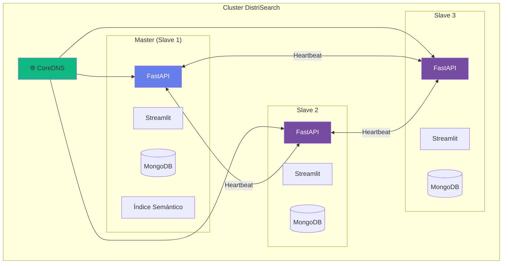
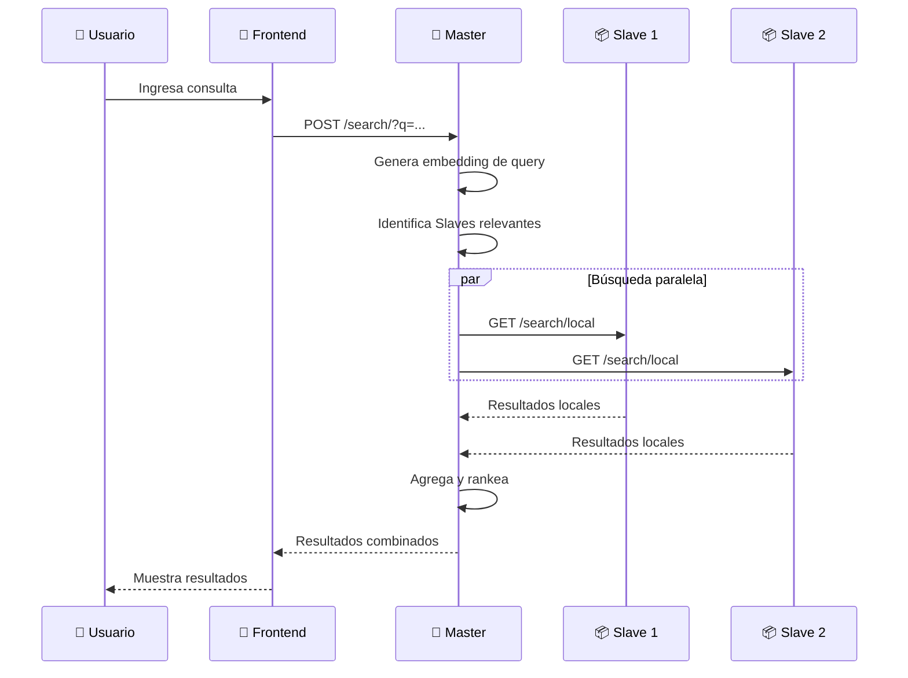
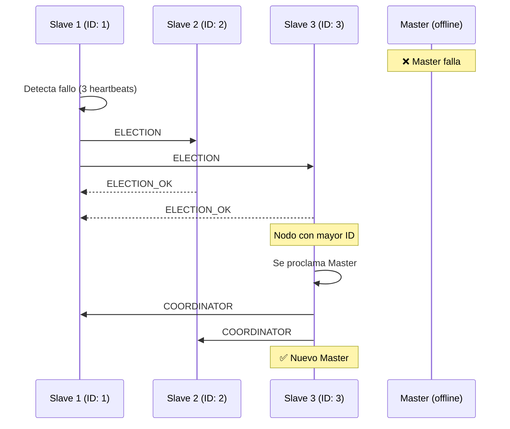
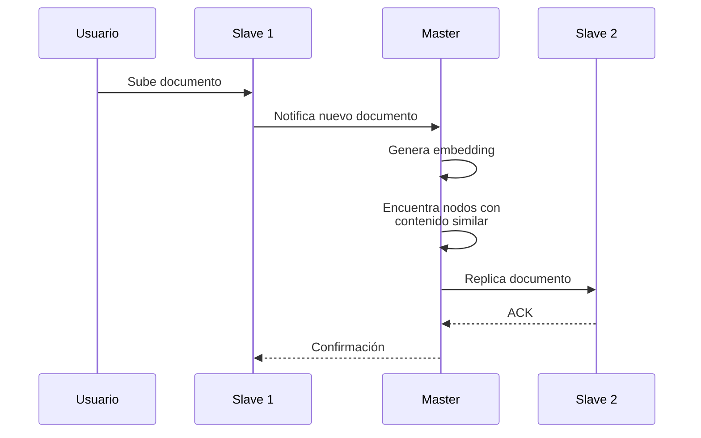
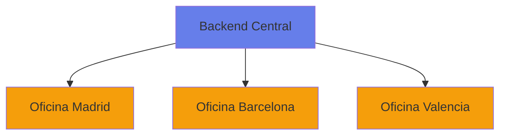

# Introducción a DistriSearch

<div class="hero-banner" style="padding: 2rem; background: linear-gradient(135deg, rgba(102, 126, 234, 0.1) 0%, rgba(118, 75, 162, 0.1) 100%); border-radius: 16px; margin-bottom: 2rem; border-left: 4px solid #667eea;">
  <h2 style="margin-top: 0;">📖 Sistema de Búsqueda Distribuida</h2>
  <p>Arquitectura <strong>Master-Slave</strong> con ubicación semántica y alta disponibilidad</p>
</div>

## 🎯 ¿Qué es DistriSearch?

**DistriSearch** es un sistema de búsqueda distribuida que utiliza una arquitectura **Master-Slave** con:

| Característica | Descripción |
|----------------|-------------|
| 🧠 **Ubicación Semántica** | Localiza recursos por similitud de contenido usando embeddings |
| 👑 **Elección Dinámica** | Cualquier nodo puede ser Master (algoritmo Bully) |
| 💓 **Heartbeats UDP** | Detección de fallos en ~15 segundos |
| 🔄 **Replicación Inteligente** | Por afinidad semántica, no por hash |

!!! success "Beneficios Clave"
    - ✅ **Alta disponibilidad**: Failover automático sin intervención manual
    - ✅ **Búsqueda semántica**: Resultados relevantes por significado, no solo palabras
    - ✅ **Escalabilidad horizontal**: Agregar nodos sin reconfiguración
    - ✅ **Privacidad**: Archivos permanecen en nodos de origen

---

## 🏛️ Arquitectura Master-Slave

DistriSearch abandona las arquitecturas P2P puras (DHT, hipercubo) en favor de un modelo **Master-Slave dinámico**:



### Componentes por Nodo

Cada **Slave** es un nodo completo que incluye:

=== "Backend (FastAPI)"
    
    - API REST para búsqueda y gestión
    - Servicios de heartbeat y elección
    - Conexión a MongoDB local
    - Endpoints de health check

=== "Frontend (Streamlit)"
    
    - Interfaz web moderna
    - Búsqueda distribuida
    - Gestión de nodos
    - Estadísticas en tiempo real

=== "Base de Datos (MongoDB)"
    
    - Almacenamiento de documentos
    - Metadatos de archivos
    - Réplicas por afinidad semántica

### El Master Adiciona

El nodo que actúa como **Master** mantiene servicios adicionales:

- 🧠 **Índice de Ubicación Semántica**: Mapea embeddings a nodos
- ⚖️ **Balanceador de Carga**: Distribuye consultas
- 🔄 **Coordinador de Replicación**: Gestiona réplicas
- 🎯 **Query Router**: Enruta a Slaves relevantes

---

## 🔄 Flujos de Trabajo

### Búsqueda Distribuida Semántica



### Elección de Líder (Bully Algorithm)



### Replicación por Afinidad Semántica



---

## 💡 Conceptos Clave

### Ubicación Semántica vs DHT

A diferencia de sistemas basados en DHT (tablas hash distribuidas), DistriSearch usa **ubicación semántica**:

| Aspecto | DHT Tradicional | DistriSearch |
|---------|-----------------|--------------|
| **Ubicación** | Hash del nombre → nodo | Embedding del contenido → nodos similares |
| **Búsqueda** | Por clave exacta | Por similitud semántica |
| **Replicación** | Por hash (aleatorio) | Por afinidad de contenido |
| **Ventaja** | Localización O(log N) | Resultados más relevantes |

### Embeddings Semánticos

DistriSearch genera vectores de 384 dimensiones usando `sentence-transformers`:

```python
# EmbeddingService (master/embedding_service.py)
from sentence_transformers import SentenceTransformer

model = SentenceTransformer('all-MiniLM-L6-v2')
embedding = model.encode("texto del documento")  # → Vector 384D
```

!!! info "Similitud Coseno"
    Dos documentos son similares si el ángulo entre sus vectores es pequeño:
    
    $$\text{similitud} = \frac{A \cdot B}{||A|| \cdot ||B||}$$

### Sistema de Heartbeats

Los nodos envían heartbeats UDP cada 5 segundos:

```
Puerto 5000: Heartbeats (PING/PONG)
Puerto 5001: Elección de líder (ELECTION/COORDINATOR)
```

| Estado | Condición | Acción |
|--------|-----------|--------|
| `online` | Heartbeat OK | Normal |
| `suspected` | 1-2 beats fallidos | Monitoreo |
| `offline` | 3+ beats fallidos | Elección si era Master |

### Algoritmo Bully para Elección

Cuando el Master falla, los Slaves candidatos ejecutan el algoritmo Bully:

!!! example "Reglas del Algoritmo"
    1. **Inicio**: Cualquier nodo puede iniciar elección
    2. **Mensaje ELECTION**: Se envía a nodos con ID mayor
    3. **Respuesta OK**: Nodos mayores responden y asumen elección
    4. **Proclamación**: Nodo con mayor ID envía COORDINATOR a todos
    5. **Nuevo Master**: Todos reconocen al nuevo líder
    El score BM25 indica qué tan relevante es un documento para una consulta. Un score más alto significa mayor relevancia.

### Modo Distribuido vs Centralizado

DistriSearch soporta dos modos de operación:

=== "Modo Distribuido"

    **Descripción**: Cada nodo mantiene su propio índice de archivos.
    
    **Ventajas**:
    
    - ✅ Máxima escalabilidad
    - ✅ Tolerancia a fallos
    - ✅ Autonomía de nodos
    
    **Ideal para**: Redes P2P, organizaciones distribuidas

=== "Modo Centralizado"

    **Descripción**: Un índice central almacena todos los archivos de una carpeta compartida.
    
    **Ventajas**:
    
    - ✅ Simplicidad de gestión
    - ✅ Búsquedas más rápidas
    - ✅ Menos overhead de red
    
    **Ideal para**: Servidores únicos, pruebas, desarrollo

---

## 🔐 Seguridad

DistriSearch implementa múltiples capas de seguridad:

| Aspecto | Implementación |
|---------|----------------|
| **Autenticación** | API Keys opcionales |
| **Autorización** | Validación de permisos por endpoint |
| **CORS** | Configurado para dominios permitidos |
| **Validación** | Pydantic para validación de datos |
| **Rate Limiting** | Prevención de abuso (configurable) |

---

## 📊 Casos de Uso

### 1. Organización Multisite

Una empresa con oficinas en diferentes ciudades necesita buscar documentos distribuidos.



### 2. Equipo de Investigación

Investigadores comparten datasets grandes distribuidos en diferentes servidores.

### 3. Centro de Datos

Múltiples servidores de almacenamiento necesitan un sistema de búsqueda unificado.

### 4. Desarrollo Colaborativo

Equipos de desarrollo con recursos compartidos en diferentes máquinas.

---

## 🚀 Ventajas de DistriSearch

<div class="grid" markdown>

!!! success "Escalabilidad"
    Añade nodos ilimitadamente sin degradar el rendimiento.

!!! success "Rendimiento"
    Búsquedas paralelas en milisegundos con BM25.

!!! success "Tolerancia a Fallos"
    Replicación automática si un nodo falla.

!!! success "Interfaz Moderna"
    UI atractiva con Streamlit y componentes personalizados.

!!! success "Fácil Despliegue"
    Docker y Docker Compose para despliegue simple.

!!! success "Open Source"
    Código abierto bajo licencia MIT.

</div>

---

## 📈 Evolución del Proyecto

DistriSearch ha evolucionado a través de varias versiones:

| Versión | Características | Fecha |
|---------|----------------|-------|
| **v1.0** | Backend básico, búsqueda simple | 2024-Q3 |
| **v1.5** | Agentes, modo distribuido | 2024-Q4 |
| **v2.0** | Frontend moderno, BM25, Docker | 2025-Q1 |
| **v2.1** | Replicación, tolerancia a fallos | 2025-Q2 |

---

## 🎓 Prerequisitos para Usuarios

### Conocimientos Recomendados

- 🐍 Python básico
- 🌐 Conceptos de APIs REST
- 🐳 Docker (opcional, para despliegue)
- 💻 Línea de comandos

### Conocimientos Técnicos (Desarrolladores)

- 🔧 FastAPI y desarrollo de APIs
- 🎨 Streamlit para interfaces web
- 💾 SQLAlchemy y bases de datos
- 🏗️ Arquitecturas distribuidas

---

## 📚 Próximos Pasos

Ahora que conoces los conceptos básicos de DistriSearch, te recomendamos:

1. [:octicons-rocket-24: Guía de Inicio Rápido](getting-started/index.md)
2. [:octicons-code-24: Instalación Detallada](getting-started/instalacion.md)
3. [:octicons-tools-24: Arquitectura Completa](arquitectura.md)
4. [:octicons-book-24: API Reference](api/index.md)

---

!!! question "¿Tienes Dudas?"
    Consulta nuestra sección de [Preguntas Frecuentes](faq.md) o revisa la documentación de cada componente.
